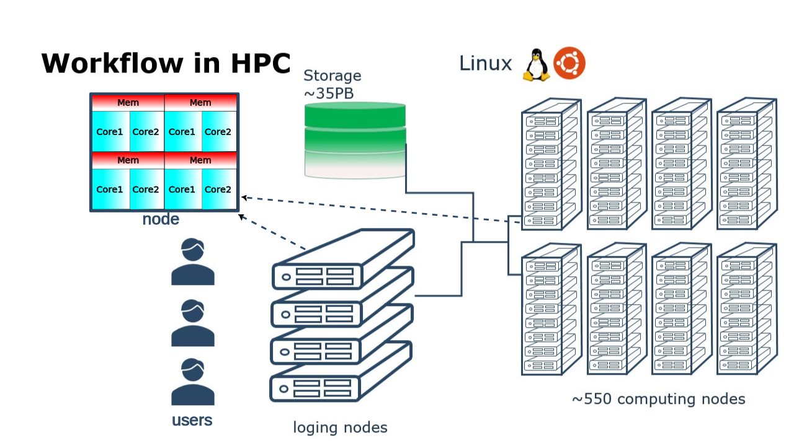

Parallel and multithreaded functions
====================================

.. questions::

   - What is parallel programming?
   - Why do we need it?
   - Where I can use it?

   
   
.. objectives:: 

   - Short introduction to parallel programming
   - Common paradigms to write a parallel code

    

What is parallel programming?
-----------------------------

Parallel programming is the art of writing code that execute tasks on different
computing units (cores) simultaneously. In the past computers were shiped with a
single core per Central Processing Unit (CPU) and therefore it could only perform
a single computation at the time (serial program).

Nowadays computer architectures are more complex than the single core CPU mentioned
already. For instance, common architectures include those where several cores in a
CPU share a common memory space and also those where CPUs are connected through some
network interconnect.

.. figure:: ../../img/shared-distributed-mem.svg
   :width: 550
   :align: center

   Shared Memory and Distributed Memory architectures.
 
A more realistic picture of a computer architecture can be seen in the following 
picture where we have 14 cores that shared a common memory of 64 GB. These cores
form the socket and the two sockets shown in this picture constitute a node.

.. figure:: ../../img/cpus.png
   :width: 550
   :align: center

   1 standard node on Kebnekaise @HPC2N 

It is interesting to notice that there are different types of memory that are
available for the cores, ranging from the L1 cache to the node's memory for a single
node. In the former, the bandwidth can be TB/s while in the latter GB/s.

Now you can see that on a single node you already have several computing units
(cores) and also a hierarchy of memory resources which is denoted as Non Uniform
Memory Access (NUMA).

Besides the standard CPUs, nowadays one finds Graphic Processing Units (GPUs) 
architectures in HPC clusters, a K80 engine looks like this:

.. figure:: ../../img/gpu.png
   :align: center

   A single GPU engine of a K80 card. Each green dot represents a core (single precision) which
   runs at a frequency of 562 MHz. The cores are arranged in slots called streaming multiprocessors (SMX)
   in the figure. Cores in the same SMX share some local and fast cache memory.

In a typical cluster, some GPUs are attached to a single node resulting in a CPU-GPU
hybrid architecture. The CPU component is called the host and the GPU part the device.
One possible layout (Kebnekaise) is as follows:

.. figure:: ../../img/cpu-gpu.png
   :width: 450  
   :align: center

   Schematics of a hybrid CPU-GPU architecture. A GPU K80 card consisting of two engines is attached
   to a NUMA island which in turn contains 14 cores. The NUMA island and the GPUs are
   connected through a PCI-E interconnect which makes the data transfer between both components rather
   slow.

Why is parallel programming needed?
-----------------------------------

There is no "free lunch" when trying to use features (computing/memory resources) in
modern architectures. If you want your code to be aware of those features, you will
need to either add them explicitly (by coding them yourself) or implicitly (by using
libraries that were coded by others).

In your local machine, you may have some number of cores available and some memory 
attached to them which can be exploited by using a parallel program. There can be
some limited resources for running your data-production simulations as you may use
your local machine for other purposes such as writing a manuscript, making a presentation,
etc. One alternative to your local machine can be a High Performance Computing (HPC)
cluster another could be a cloud service. A common layout for the resources in an
HPC cluster is a shown in the figure below.

   High Performance Computing (HPC) cluster.

Although a serial application can run in such a cluster, it would not gain much of the
HPC resources. The situation would be similar to turn on many washing machines to wash
a single item, we can waste energy easily.

.. figure:: ../../img/laundry-machines.svg
   :width: 300
   :align: center

.. figure:: ../../img/laundry-machines.svg
   :width: 300
   :align: center

   Under-using a cluster.

Common parallel programming paradigms
-------------------------------------

Now the question is how to take advantage of modern architectures which consist of many-cores,
interconnected through networks, and that have different types of memory available?
Python, Julia, and R languages have different tools and libraries that can help you
to get more from your local machine or HPC cluster resources.

Threaded programming
''''''''''''''''''''

To take advantage of the shared memory of the cores, **threaded** mechanisms can be used.
Low-level programming languages, such as Fortra/C/C++, use OpenMP as the standard
application programming interface (API) to parallelize programs by using a threaded mechanism.
Here, all threads have access to the same data and can do computations simultaneously. 
Higher-level languages have their own mechanisms to generate threads and this can be
confusing especially if the code is using external libraries, linear algebra for instance
(LAPACK, BLAS, ...). These libraries have their own threads (OpenMP for example) and
the code you are writing can also have some threded mechanism such as `Julia threads`.
Due to a locking mechanism in Python, `Python threads` are not efficient for computation.
However, the `Mojo project <https://docs.modular.com/mojo/notebooks/Mandelbrot.html#benchmarking>`_
is striving to leverage the threaded parallelism in Python.
            
From the previous paragraph we infer that without doing any modification to our code
we can get the benefits from parallel computing by turning-on/off external libraries,
by setting environment variables such as `OMP_NUM_THREADS`.

A common issue with shared memory programming is *data racing* which happens when 
different threads write on the same memory address. 

GPU programming has similar patterns to shared memory programming but there are
major differences, for instance in the former one works with highly optimized 
pieces of code that can run on thousand of cores (*kernels*). Also the APIs
are different, with NVIDIA and ROCM being two of the most common ones in GPU
programming.

Distributed programming
'''''''''''''''''''''''

Although threaded programming is convenient because one can achieve considerable initial speedups
with little code modifications, this approach does not scale for more than hundreds of 
cores. Scalability can be achieved with distributed programming. Here, there is not
a common shared memory but the individual `processes` (notice the different terminology
with `threads` in shared memory) have their own memory space. Then, if a process requires
data from or should transfer data to another process, it can do that by using `send` and
`receive` to transfer messages. A standard API for distributed computing is the Message 
Passing Interface (MPI). In general, MPI requires refactoring of your code.

.. demo:: 

   .. tabs::

      .. tab:: Python

         In the following example ``sleep.py`` the `sleep()` function is called `n` times first in serial mode and then by using `n` processes. 

         .. code-block:: python

            import sys
            from time import perf_counter,sleep
            import multiprocessing

            # number of iterations 
            n = 6
            # number of processes
            numprocesses = 6

            def sleep_serial(n):
                for i in range(n):
                    sleep(1)

            def sleep_threaded(n,numprocesses,processindex):
                # workload for each process
                workload = n/numprocesses
                begin = int(workload*processindex)
                end = int(workload*(processindex+1))
                for i in range(begin,end):
                    sleep(1)

            if __name__ == "__main__":

            starttime = perf_counter()   # Start timing serial code
            sleep_serial(n)
            endtime = perf_counter()

            print("Time spent serial: %.2f sec" % (endtime-starttime))

            starttime = perf_counter()   # Start timing parallel code
            processes = []
            for i in range(numprocesses):
                p = multiprocessing.Process(target=sleep_threaded, args=(n,numprocesses,i))
                processes.append(p)
                p.start()

            # waiting for the processes
            for p in processes:
                p.join()

            endtime = perf_counter()

            print("Time spent parallel: %.2f sec" % (endtime-starttime))

         First load the modules ``ml GCCcore/10.3.0 Python/3.9.5`` and then run the script
         with the command  ``python sleep.py`` to use 6 processes.

         **DASK**
        
 
         There are other strategies that are more automatic. **Dask** is a array model extension and task scheduler. By using the new array classes, you can automatically distribute operations across multiple CPUs.

         Dask is very popular for data analysis and is used by a number of high-level Python libraries:

            - Dask arrays scale NumPy (see also xarray)
            - Dask dataframes scale Pandas workflows
            - Dask-ML scales Scikit-Learn

         - Dask divides arrays into many small pieces (chunks), as small as necessary to fit it into memory. 
         - Operations are delayed (lazy computing) e.g. tasks are queue and no computation is performed until 
          you actually ask values to be computed (for instance print mean values). 
         - Then data is loaded into memory and computation proceeds in a streaming fashion, block-by-block.

      .. tab:: Julia

         In the following example ``sleep-threads.jl`` the `sleep()` function is called `n` times
         first in serial mode and then by using `n` threads. The *BenchmarkTools* package
         help us to time the code (this package is not in the base Julia installation).

         .. code-block:: julia

            using BenchmarkTools
            using .Threads
            
            n = 6   # number of iterations
             
            function sleep_serial(n)   #Serial version
                for i in 1:n
                    sleep(1)
                end
            end
            
            @btime sleep_serial(n) evals=1 samples=1
            
            function sleep_threaded(n) #Parallel version
                @threads for i = 1:n
                    sleep(1)
                end
            end
            
            @btime sleep_threaded(n) evals=1 samples=1
            
         First load the Julia module ``ml Julia/1.8.5-linux-x86_64`` and then run the script
         with the command  ``julia --threads 6 sleep-threads.jl`` to use 6 Julia threads.

         We can also use the *Distributed* package that allows the scaling of simulations beyond
         a single node (call the script ``sleep-distributed.jl``): 

         .. code-block:: julia

            using BenchmarkTools
            using Distributed 

            n = 6   # number of iterations

            function sleep_parallel(n)
                @distributed for i in 1:n
                    sleep(1)
                end
            end         

         Run the script with the command  ``julia -p 6 sleep-distributed.jl`` to use 6 Julia processes.

      .. tab:: R 
   
         In the following example ``sleep.R`` the `sleep()` function is called `n` times
         first in serial mode and then by using `n` processes. Start by loading the 
         modules ``ml GCC/10.2.0 OpenMPI/4.0.5 R/4.0.4``

         .. code-block:: r
        
            library(doParallel)

            # number of iterations = number of processes
            n <- 6

            sleep_serial <- function(n) {
              for (i in 1:n) {
                  Sys.sleep(1)
              }
            }

            serial_time <- system.time(   sleep_serial(n)   )[3]
            serial_time

            sleep_parallel <- function(n) {
              r <- foreach(i=1:n) %dopar% Sys.sleep(1)
            }
              
            cl <- makeCluster(n)
            registerDoParallel(cl)
            parallel_time <- system.time(    sleep_parallel(n)   )[3]
            stopCluster(cl)
            parallel_time

         Run the script with the command  ``Rscript --no-save --no-restore sleep.R``.

         In this second example, a *lapply* function is used in parallel mode to compute the root
         square of a sequence of numbers (call the script ``clusterapply.R``):

         .. code-block:: r
        
            library(parallel)

            # Define a function to be applied
            square_function <- function(x) {
                return(sqrt(x))
            }

            # Create the sequence of values
            numbers <- seq(1,1000000)

            # Create a cluster with 4 workers
            cl <- makeCluster(4)

            # Use a parallel lapply function
            result_parallel <- clusterApply(cl, numbers, square_function)

            # Stop the cluster
            stopCluster(cl)

            # Print the result
            print(unlist(result_parallel))

         Run the script with the command  ``Rscript --no-save --no-restore clusterapply.R``.

Exercises
---------

.. challenge:: Parallelizing a *for loop* workflow

   .. tabs:: 

        .. tab:: Python

            Pandas is available in the following combo ``ml GCC/12.3.0 SciPy-bundle/2023.07`` (HPC2N) and 
            ``ml python/3.11.8`` (UPPMAX). Call the script ``script-df.py``. 

            .. code-block:: python

                import pandas as pd
                import multiprocessing

                # Create a DataFrame with two sets of values ID and Value
                data_df = pd.DataFrame({
                    'ID': range(1, 10001),
                    'Value': range(3, 20002, 2)  # Generate 10000 odd numbers starting from 3
                })

                # Define a function to calculate the sum of a vector
                def calculate_sum(values):
                    total_sum = *FIXME*(values)
                    return *FIXME*

                # Split the 'Value' column into chunks of size 1000
                chunk_size = *FIXME*
                value_chunks = [data_df['Value'][*FIXME*:*FIXME*] for i in range(0, len(data_df['*FIXME*']), *FIXME*)]

                # Create a Pool of 4 worker processes, this is required by multiprocessing
                pool = multiprocessing.Pool(processes=*FIXME*)

                # Map the calculate_sum function to each chunk of data in parallel
                results = pool.map(*FIXME: function*, *FIXME: chunk size*)

                # Close the pool to free up resources, if the pool won't be used further
                pool.close()

                # Combine the partial results to get the total sum
                total_sum = sum(results)

                # Compute the mean by dividing the total sum by the total length of the column 'Value'
                mean_value = *FIXME* / len(data_df['*FIXME*'])

                # Print the mean value
                print(mean_value)

            Run the code with the batch script (HPC2N): 
            
                    .. code-block:: sh
                        
                        #!/bin/bash            
                        #SBATCH -A hpc2n2023-110     # your project_ID       
                        #SBATCH -J job-serial        # name of the job         
                        #SBATCH -n 1                 # nr. tasks  
                        #SBATCH --time=00:20:00      # requested time
                        #SBATCH --error=job.%J.err   # error file
                        #SBATCH --output=job.%J.out  # output file  

                        # Load any modules you need, here for Python 3.11.3 and compatible SciPy-bundle
                        module load GCC/12.3.0 Python/3.11.3 SciPy-bundle/2023.07
                        python script-df.py

             UPPMAX...

        .. tab:: Julia

            The package *DataFrames* needs to be added in a Julia session in case you haven't done it previously.
            The functions **nthreads()** (number of available threads), and **threadid()** (the thread identification 
            number) will be useful in this task. Call the script ``script-df.jl``.

            .. code-block:: julia

                using DataFrames
                using Base.Threads

                # Create a data frame with two sets of values ID and Value
                data_df = DataFrame(ID = 1:10000, Value = range(3, step=2, length=10000))

                # Define a function to compute the sum in parallel
                function parallel_sum(data)
                    # Initialize an array to store thread-local sums
                    local_sums = zeros(eltype(data), nthreads())
                    # Iterate through each value in the 'Value' column in parallel
                    @threads for i =1:length(data)
                        # Add the value to the thread-local sum
                        local_sums[threadid()] += data[i]
                    end
                    # Combine the local sums to obtain the total sum
                    total_sum_parallel = sum(local_sums)
                    return total_sum_parallel
                end

                # Compute the sum in parallel
                total_sum_parallel = parallel_sum(data_df.Value)

                # Compute the mean
                mean_value_parallel = total_sum_parallel / length(data_df.Value)

                # Print the mean value
                println(mean_value_parallel)    

            Run this job with the following batch script (HPC2N):

                    .. code-block:: sh
                        
                        #!/bin/bash            
                        #SBATCH -A hpc2n2023-110     # your project_ID       
                        #SBATCH -J job-serial        # name of the job         
                        #SBATCH -n 1                 # nr. tasks  
                        #SBATCH --time=00:20:00      # requested time
                        #SBATCH --error=job.%J.err   # error file
                        #SBATCH --output=job.%J.out  # output file  

                        ml purge  > /dev/null 2>&1
                        ml Julia/1.8.5-linux-x86_64

                        julia --threads X script-df.jl  # X number of threads

            UPPMAX ...

           

        .. tab:: R

            Call the script ``script-df.R``.

            .. code-block:: r 

                library(doParallel)
                library(foreach)

                # Create a data frame with two sets called ID and Value
                data_df <- data.frame(
                ID <- seq(1,10000), Value <- seq(from=3,by=2,length.out=10000)
                )

                # Create 4 subsets
                num_subsets <- *FIXME*

                # Create a cluster with 4 workers
                cl <- makeCluster(*FIXME*)

                # Register the cluster for parallel processing
                registerDoParallel(cl)

                # Function to process a subset of the whole data
                process_subset <- function(subset) {
                # Perform some computation on the subset
                subset_sum <- sum(*FIXME*)
                return(data.frame(SubsetSum = subset_sum))
                }

                # Use foreach with dopar to process subsets in parallel
                result <- foreach(i = 1:*FIXME*, .combine = rbind) %dopar% {
                # Determine the indices for the subset
                subset_indices <- seq(from = *FIXME*,
                                        to = *FIXME*)
                
                # Create the subset
                subset_data <- data_df[*FIXME*, , drop = FALSE]
                
                # Process the subset
                subset_result <- process_subset(*FIXME*)
                
                return(subset_result)
                }

                # Stop the cluster when done
                stopCluster(cl)

                # Print the results
                print(sum(*FIXME*)/*FIXME*)
            
            Run the code with the following batch script (HPC2N):

                    .. code-block:: sh
                        
                        #!/bin/bash            
                        #SBATCH -A hpc2n2023-110     # your project_ID       
                        #SBATCH -J job-serial        # name of the job         
                        #SBATCH -n 1                 # nr. tasks  
                        #SBATCH --time=00:20:00      # requested time
                        #SBATCH --error=job.%J.err   # error file
                        #SBATCH --output=job.%J.out  # output file  

                        ml purge > /dev/null 2>&1
                        ml GCC/10.2.0  OpenMPI/4.0.5  R/4.0.4
                        Rscript --no-save --no-restore script-df.R

            UPPMAX ...

.. solution:: Solution

   .. tabs:: 

      .. tab:: Python
      
            .. code-block:: python
	 
                import pandas as pd
                import multiprocessing

                # Create a DataFrame with two sets of values ID and Value
                data_df = pd.DataFrame({
                    'ID': range(1, 10001),
                    'Value': range(3, 20002, 2)  # Generate 10000 odd numbers starting from 3
                })

                # Define a function to calculate the sum of a vector
                def calculate_sum(values):
                    total_sum = sum(values)
                    return total_sum

                # Split the 'Value' column into chunks
                chunk_size = 1000
                value_chunks = [data_df['Value'][i:i+chunk_size] for i in range(0, len(data_df['Value']), chunk_size)]

                # Create a Pool of 4 worker processes, this is required by multiprocessing
                pool = multiprocessing.Pool(processes=4)

                # Map the calculate_sum function to each chunk of data in parallel
                results = pool.map(calculate_sum, value_chunks)

                # Close the pool to free up resources, if the pool won't be used further
                pool.close()

                # Combine the partial results to get the total sum
                total_sum = sum(results)

                # Compute the mean by dividing the total sum by the total length of the column 'Value'
                mean_value = total_sum / len(data_df['Value'])

                # Print the mean value
                print(mean_value)               

      .. tab:: Julia
         
            .. code-block:: julia

                using DataFrames
                using Base.Threads

                # Create a data frame with two sets of values ID and Value
                data_df = DataFrame(ID = 1:10000, Value = range(3, step=2, length=10000))

                # Define a function to compute the sum in parallel
                function parallel_sum(data)
                    # Initialize an array to store thread-local sums
                    local_sums = zeros(eltype(data), nthreads())
                    # Iterate through each value in the 'Value' column in parallel
                    @threads for i =1:length(data)
                        # Add the value to the thread-local sum
                        local_sums[threadid()] += data[i]
                    end
                    # Combine the local sums to obtain the total sum
                    total_sum_parallel = sum(local_sums)
                    return total_sum_parallel
                end

                # Compute the sum in parallel
                total_sum_parallel = parallel_sum(data_df.Value)

                # Compute the mean
                mean_value_parallel = total_sum_parallel / length(data_df.Value)

                # Print the mean value
                println(mean_value_parallel)   
	 
      .. tab:: R

            .. code-block:: r 

                library(doParallel)
                library(foreach)

                # Create a data frame with two sets called ID and Value
                data_df <- data.frame(
                ID <- seq(1,10000), Value <- seq(from=3,by=2,length.out=10000)
                )

                # Create 4 subsets
                num_subsets <- 4

                # Create a cluster with 4 workers
                cl <- makeCluster(4)

                # Register the cluster for parallel processing
                registerDoParallel(cl)

                # Function to process a subset of the whole data
                process_subset <- function(subset) {
                # Perform some computation on the subset
                subset_sum <- sum(subset$Value)
                return(data.frame(SubsetSum = subset_sum))
                }

                # Use foreach with dopar to process subsets in parallel
                result <- foreach(i = 1:num_subsets, .combine = rbind) %dopar% {
                # Determine the indices for the subset
                subset_indices <- seq(from = 1 + (i - 1) * nrow(data_df) / num_subsets,
                                        to = i * nrow(data_df) / num_subsets)
                
                # Create the subset
                subset_data <- data_df[subset_indices, , drop = FALSE]
                
                # Process the subset
                subset_result <- process_subset(subset_data)
                
                return(subset_result)
                }

                # Stop the cluster when done
                stopCluster(cl)

                # Print the results
                print(sum(result)/10000)	     
	     

.. admonition:: More info

   - `HPC2N Julia documentation <https://www.hpc2n.umu.se/resources/software/julia>`_.
   - `HPC2N R documentation <https://www.hpc2n.umu.se/resources/software/r>`_.
   - `Introduction to Dask by Aalto Scientific Computing and CodeRefinery <https://aaltoscicomp.github.io/python-for-scicomp/parallel/#dask-and-task-queues>`_
   - `Intermediate level Dask by ENCCS <https://enccs.github.io/hpda-python/dask/>`_.
   - `Official Python documentation <https://www.python.org/doc/>`_.
   - `Wikipedias' article on Parallel Computing <https://en.wikipedia.org/wiki/Parallel_computing>`_ 
   - The book `High Performance Python <https://www.oreilly.com/library/view/high-performance-python/9781492055013/>`_ is a good resource for ways of speeding up Python code.
    

