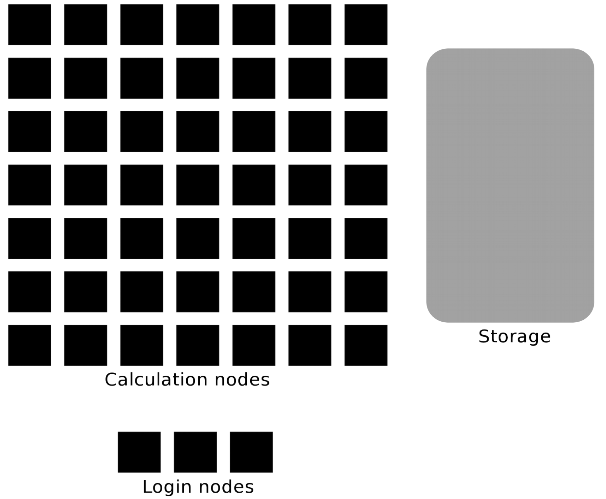

.. R-python-julia-matlab-HPC documentation master file, created by
   sphinx-quickstart on Fri Jan 21 18:24:04 2022.
   You can adapt this file completely to your liking, but it should at least
   contain the root `toctree` directive.

Introduction to running R, Python, Julia, and Matlab in HPC
===================================================

.. admonition:: Content

   - This course aims to give a brief, but comprehensive introduction to using Python, Julia, R, and Matlab in an HPC environment.
   - You will learn how to
      - start the **interpreters** of Python, Julia, R, and Matlab by the HPC module system
      - find site **installed packages/libraries**
      - **install packages/libraries** yourself
      - use **virtual** environments
        [RB: if the goal is to use a programming language in an HPC environment,
        virtual environments are not necessary for this, hence this should be 
        removed. If there is a language that does enforce to use venvs, then,
        yes, this should be in. Virtual environments are a useful tool for
        users that need multiple environments at the same time, such
        as developers or advanced users. I feel this course does not assume
        this level of knowledge]
      - use the **computation nodes**
        
         - write batch scripts 
         - work interactivly
      - [RB: I miss the parallel computing and the machine learning sessions. 
        I would enjoy to see their goals here too]

   - This course will consist of lectures interspersed with hands-on sessions
     where you get to try out what you have just learned.
     [RB: one could consider this false, as consistently the evaluations give
     back that there should be more exercises. I do hope this will be true.]

   - We aim to give this course in **spring and fall every year**.

.. admonition:: Course approach to deal with multiple HPC centers

   - The course is a cooperation between **UPPMAX** (Rackham, Snowy, Bianca), **HPC2N** (Kebnekaise), and **LUNARC** (Cosmos) and will focus on the compute systems at all three centres.
   - Although there are differences we will only have **few seperate sessions**.
   - Most participants will use UPPMAX's systems for the course, as Kebnekaise and Cosmos are only for local users. Kebnekaise: UmU, IRF, MIUN, SLU, LTU. Cosmos: LU. 
   - The general information given in the course will be true for all/most HPC centres in Sweden. 

      - The examples will often have specific information, like module names and versions, which may vary. What you learn here should help you to make any changes needed for the other centres. 
      - When present, links to the Python/Julia/R/Matlab documentation at other NAISS centres are given in the corresponding session.

Schedule Fall 2024
--------------------

.. list-table:: 
   :widths: 25 25
   :header-rows: 1

   * - Day
     - Language
   * - Tuesday 22 October
     - Python 
   * - Wednesday 23 October
     - Julia
   * - Thursday 24 October
     - R 
   * - Friday 25 October
     - Matlab
   

Some practicals
---------------

Code of Conduct
:::::::::::::::

[RB: I suggest to remove the CoC, as we should, as teachers, have high
expectations of our learners and a CoC shows we assume otherwise.
Sure, having the standard ``CODE_OF_CONDUCT.md`` in the root folder
of this repo is fine. Putting it this explicitly in the course material,
however, feels like showing we expect our learners to misbehave. Maybe
we need to vote on this?]

We strive to follow the Contributor Covenant Code of Conduct to foster an inclusive and welcoming environment for everyone.

In short:

- Use welcoming and inclusive language
- Be respectful of different viewpoints and experiences
- Gracefully accept constructive criticism
- Focus on what is best for the community
- Show courtesy and respect towards other community members

Furthermore, as this is a hands-on, interactive workshop:

- Be kind to each other and help each other as best you can.
- If you can't help someone or there is some problem, let someone know.

[RB: I enjoy the intention behind the text below. However, we can/should expect
our learners to do so: they are responsible for their learning too!
Of course, we should give them the space/time to correct us somewhere. 

Finally, if you notice something that prevents you from learning as well as you can, let us know and don't suffer silently, even the "little things":

[RB: I don't think we need to
give examples of what causes some learners to suffer]

  - Volume too low?
  - Font size too small?
  - Generally confusing instructor?
  - Not enough breaks?

 
.. admonition:: Zoom

    The course is run over Zoom. You should have gotten an email with the links
      
    This is the Zoom policy:
  
    - Use your real name when joining the meeting
    - Mute your microphone when you are not speaking
    - Use the Zoom 'Raise hand' functionality to indicate you have a question
    - Use the collaboration document (see below) for questions
      regarding the course content
    - Use the chat for questions that are unrelated
      to the course content (e.g. 'My mic does not work')
    - The Zoom main room is used for most lectures
    - Some sessions use breakout rooms for exercises, 
      some of which use a silent room
       
    This is the recording policy:
    
    - The lectures and demos will be recorded.
    - The questions asked per microphone during these sessions will be recorded
    - For unrecorded questions during these sessions,
      use the collaboration document (see below)

    
.. admonition:: Collaboration document

   - .. raw:: html

        <a target='_blank' href="https://umeauniversity.sharepoint.com/:w:/s/HPC2N630/Ebo1tbwHnz5GhBq7p04ex6sB9or9WlqWHHWIlcUTW230mA?e=45q4Aa">Q/A collaboration document</a>

   - Use this page for the workshop with your questions
   - It helps us identify content that is missing in the course material
   - We answer those questions as soon as possible

        
.. hint::

   - Main project on UPPMAX:
     
        - Project ID: ``naiss2024-22-1202``
        - Directory name on rackham: ``/proj/r-py-jl-m-rackham``
        - Please create a suitably named subdirectory below ``/proj/r-py-jl-m-rackham``, for your own exercises. 
   

   - Local project on HPC2N: 

        - Project ID: ``hpc2n2024-114``
        - Directory name on Kebnekaise: ``/proj/nobackup/r-py-jl-m``
        - Please create a suitably named subdirectory below ``/proj/nobackup/r-py-jl-m``, for your own exercises.

   
Example of screen arrangement
:::::::::::::::::::::::::::::

[RB: I think the example screen arrangement should be removed.
I think we can assume our
learners have their own preference for how they setup their windows;
it makes us come across like parents do to little kids]

If you only have one screen to work with for the course, try to fit: 

.. code-block:: sh

   ╔════════════╗ ╔══════════════╗
   ║            ║ ║  TERMINAL    ║
   ║            ║ ║   WINDOW     ║
   ║   ZOOM     ║ ╚══════════════╝
   ║  WINDOW    ║ ╔══════════════╗
   ║            ║ ║   BROWSER    ║
   ║            ║ ║  W/MATERIAL  ║
   ╚════════════╝ ╚══════════════╝

.. warning::

   - **Please be sure that you have gone through the `pre-requirements <https://uppmax.github.io/R-python-julia-HPC/prereqs.html>`_**
   - It mentions the familiarity with the LINUX command line.
   - The applications to connect to the clusters
      - terminals
      - remote graphical desktop ThinLinc
 
Material for improving your programming skills
----------------------------------------------

- This course does not aim to improve your coding skills.
- Rather you will learn to understand the ecosystems and navigations for the the different languages on a HPC cluster.

See the pre-requirements, section `Coding <https://uppmax.github.io/R-python-julia-HPC/prereqs.html#coding>`_

Briefly about the cluster hardware and system at UPPMAX and HPC2N
-----------------------------------------------------------------

**What is a cluster?**

- Login nodes and calculations/computation nodes

- A network of computers, each computer working as a **node**.
     
- Each node contains several processor cores and RAM and a local disk called scratch.

.. figure:: ../img/node.png
   :align: center

- The user logs in to **login nodes**  via Internet through ssh or Thinlinc.

  - Here the file management and lighter data analysis can be performed.

- The **calculation nodes** have to be used for intense computing. 

The two HPC centers UPPMAX and HPC2N
====================================

.. admonition:: Two HPC centers

   - There are many similarities:
   
     - Login vs. calculation/compute nodes
     - Environmental module system with software hidden until loaded with ``module load``
     - Slurm batch job and scheduling system
     - ``pip install`` procedure
     
   - ... and small differences:
   
     - commands to load Python, Python packages, R, Julia
     - slightly different flags to Slurm
     
   - ... and some bigger differences:
   
     - UPPMAX has three different clusters 

       - Rackham for general purpose computing on CPUs only
       - Snowy available for local projects and suits long jobs (< 1 month) and has GPUs
       - Bianca for sensitive data and has GPUs

   - HPC2N has Kebnekaise with GPUs  
   - Conda is recommended only for UPPMAX users
    
.. warning:: 

   - At both HPC2N and UPPMAX we call the applications available via the *module system* **modules**. 
   - https://www.uppmax.uu.se/resources/software/module-system/ 
   - https://www.hpc2n.umu.se/documentation/environment/lmod
   
   To distinguish these modules from the **python** *modules* that work as libraries we refer to the later ones as **packages**.

.. seealso::

   - Details about the systems 
     - https://uppmax.github.io/R-python-julia-HPC/prereqs.html#common-features
     - and below

         
Content of the course
---------------------

.. toctree::
   :maxdepth: 2
   :caption: Pre-requirements:

   prereqs.md

.. toctree::
   :maxdepth: 2
   :caption: COMMON:

   common/login.rst
   common/ondemand-desktop.rst

.. toctree::
   :maxdepth: 2
   :caption: Python Lessons:

   python/intro.rst
   python/load_runPython.rst
   python/packages.rst
   python/isolated.rst
   python/batchPython.md
   python/GPU.rst
   python/interactivePython.md
   python/jupyter.md
   common/parallel.rst
   python/condaUPPMAX.rst
   python/exercisesPython.rst
   python/summaryPython.rst
   
.. toctree::
   :maxdepth: 2
   :caption: Julia Lessons:

   julia/introJulia.rst
   julia/load_runJulia.rst
   julia/isolatedJulia.rst
   julia/batchJulia.rst
   common/parallel.rst
   julia/interactiveJulia.rst
   julia/exercisesJulia.rst
   julia/summaryJulia.rst
   
.. toctree::
   :maxdepth: 2
   :caption: R Lessons:

   r/introR.rst
   r/load_runR.rst
   r/packagesR.rst
   r/isolatedR
   r/batchR.rst
   common/parallel.rst
   r/MLR.rst
   r/interactiveR.rst
   r/rstudio.rst
   r/exercisesR.rst
   r/summaryR.rst

.. toctree::
   :maxdepth: 2
   :caption: Matlab Lessons:

   matlab/introMatlab.rst
   matlab/load_runMatlab.rst
   matlab/add_onsMatlab.rst
   common/parallel.rst
   matlab/local_desktopMatlab.rst
   matlab/interactionsMatlab.rst
   matlab/interactiveMatlab.rst

.. toctree::
   :maxdepth: 2
   :caption: Extra reading:

.. Indices and tables
.. ==================

.. * :ref:`genindex`
.. * :ref:`modindex`
.. * :ref:`search`
