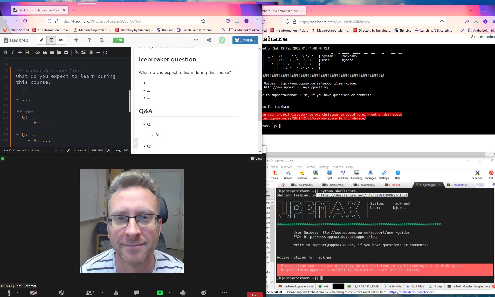
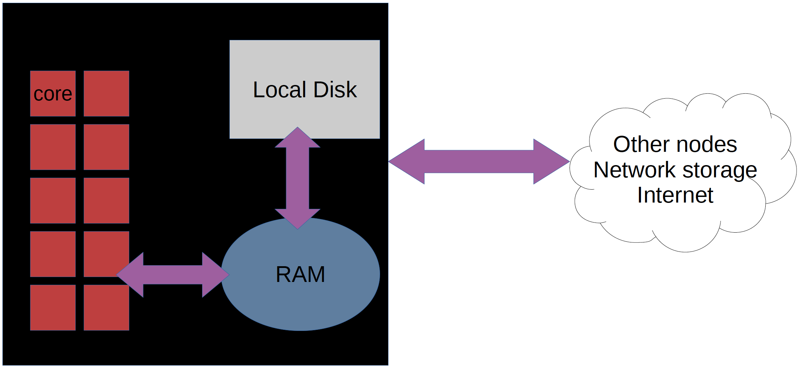

Introduction Python
===================

`Welcome page and syllabus <https://uppmax.github.io/HPC-python/index.html>`_
   - Also link at House symbol |:house:| at top of page 

.. admonition:: **Learning outcomes**
   
   - Load Python modules and site-installed Python packages
   - Create a virtual environment
   - Install Python packages with pip (Kebnekaise, Rackham, Snowy)
   - Install Python packages with conda (Bianca)
   - Write a batchscript for running Python
   - Use Python in parallel
   - Use Python for ML
   - Use GPUs with Python
   
.. warning:: Course has already been given

   - Q/A are public at the HackMD pages
      - https://hackmd.io/@bclaremar/HPC-python
      - https://hackmd.io/IoseeprATrWH0ZI7z6wJ-w?view
      

Some practicals
----------------
        
.. admonition:: Zoom

    - The course is run over Zoom. You should have gotten an email with the links
        
    - There will be a zoom for the lectures, a zoom for the HPC2N sessions, and a zoom for the UPPMAX sessions. 
        - The exercises will be done in the separate sessions.
   
    - When you join the Zoom meeting, use your REAL NAME.
    
    - The lectures and demos will be recorded, but NOT the exercises. If you ask questions during the lectures, you may thus be recorded. If you do not wish to be recorded, then please keep your microphone muted and your camera off during lectures and write your questions in the Q/A document (see below about HackMD collaboration document).
    
    - Please MUTE your microphone when you are not speaking and use the “Raise hand” functionality under the “Participants” window during the lecture. Please do not clutter the Zoom chat. Behave politely!

    - There may be breakout rooms used in the Zoom for the hands-ons. You will be randomly assigned to one of them.  
    
    
.. admonition:: Collabration document HackMD

    - Use the HackMD page for the workshop with your questions.
        - https://hackmd.io/@bclaremar/HPC-python

    - Depending on how many helpers there are we'll see how fast there are answers. 
        - Some answers may come after the workshop.
 
    - Type in the left frame 
        - "-" means new bullet and <tab> indents the level.
        - don't focus too much on the formatting if you are new to "Markdown" language!
    
    - **Have a try with the Icebreaker question**

.. admonition:: Exercises

    - You can download the exercises from the course GitHub repo, under the "Exercises" directory: https://github.com/UPPMAX/HPC-python/tree/main/Exercises 
    - On HPC2N, you can copy the exercises in a tarball from ``/proj/nobackup/snic2022-22-641/bbrydsoe/examples.tar.gz``
    - On UPPMAX you can copy the exercises in a tarball from ``/proj/snic2022-22-641/nobackup/examples.tar.gz``
    
.. admonition:: **Your expectations?**
   
    - find best practices for using Python at UPPMAX and HPC2N
    - packages
    - use the HPC performance with Python

    
    **Not covered**
    
    - improve python *coding* skills 
    - Other clusters

.. warning::

    - It is good to have a familiarity with the LINUX command line. 
    - Short introductions : https://uppsala.instructure.com/courses/67267/pages/using-the-command-line-bash?module_item_id=455632
    - Linux "cheat sheet": https://www.hpc2n.umu.se/documentation/guides/linux-cheat-sheet
    - UPPMAX software library: https://uppsala.instructure.com/courses/67267/pages/uppmax-basics-software?module_item_id=455641
    - Whole intro course material (UPPMAX): https://www.uppmax.uu.se/support/courses-and-workshops/introductory-course-winter-2022/
    - HPC2N's intro course material (including link to recordings): https://github.com/hpc2n/intro-course

.. admonition:: Prepare your environment now!
  
   - Please log in to Rackham, Kebnekaise or other cluster that you are using.

    
.. tabs::

   .. tab:: UPPMAX

      - Rackham: ``ssh <user>@rackham.uppmax.uu.se`` 
      
      - Rackham through ThinLinc, use: ``<user>@rackham-gui.uppmax.uu.se``
      - Create a working directory where you can code along. We recommend creating it under the course project storage directory
   
         
      - Example. If your username is "mrspock" and you are at UPPMAX, this we recommend you create this folder: 
     
         /proj/snic2022-22-641/nobackup/mrspock/pythonUPPMAX

   .. tab:: HPC2N

      - Kebnekaise: ``<user>@kebnekaise.hpc2n.umu.se``     
      - Kebnekaise through ThinLinc, use: ``<user>@kebnekaise-tl.hpc2n.umu.se``
   
      - Create a working directory where you can code along. We recommend creating it under the course project storage directory
   
       - Example. If your username is bbrydsoe and you are at HPC2N, then we recommend you create this folder: 
     
         /proj/nobackup/snic2022-22-641/bbrydsoe/pythonHPC2N
         
.. admonition:: Use Thinlinc or terminal?

   - It is up to you!
   - Graphics come easier with Thinlinc
   - For this course, when having many windows open, it may be better to run in terminal, for space issues.
   
   
Example of arrangement for the "worst case"!
############################################
- HackMD
- ZOOM view
- (shellshare) or web browser with course material
- your own terminal

What is python?
---------------

As you probably already know…
    
    - “Python combines remarkable power with very clear syntax.
    - It has modules, classes, exceptions, very high level dynamic data types, and dynamic typing. 
    - There are interfaces to many system calls and libraries, as well as to various windowing systems. …“

In particular, what sets Python apart from other languages is its fantastic
open-source ecosystem for scientific computing and machine learning with
libraries like NumPy, SciPy, scikit-learn and Pytorch.

- Official Python documentation is found here https://www.python.org/doc/ .
- Python forum is found here https://python-forum.io/ .
- A nice introduction to packages can be found here: https://aaltoscicomp.github.io/python-for-scicomp/dependencies/
- CodeRefinery develops and maintains training material on software best practices for researchers that already write code. Ther material addresses all academic disciplines and tries to be as programming language-independent as possible. https://coderefinery.org/lessons/
- The youtube video `Thinking about Concurrency <https://www.youtube.com/watch?v=Bv25Dwe84g0>`_ is a good introduction to writing concurrent programs in Python and the book `High Performance Python <https://www.oreilly.com/library/view/high-performance-python/9781492055013/>`_ is a good resource for ways of speeding up Python code.
    
    - And, if you feel a little unfamiliar to the LINUX world, have a look at the Introduction to UPPMAX course material here: https://www.uppmax.uu.se/support/courses-and-workshops/introductory-course-winter-2022/
    
More python?
------------

- CodeRefinery develops and maintains training material on software best practices for researchers that already write code. Their material addresses all academic disciplines and tries to be as programming language-independent as possible. https://coderefinery.org/lessons/
- General introduction to Python at https://www.uppmax.uu.se/support/courses-and-workshops/introductory-course-summer-2022/

- **This course:** Introduction to HPC (High performance computing) python at UPPMAX and HPC2N in September. 

The two HPC centers UPPMAX and HPC2N
------------------------------------

.. admonition:: Two HPC centers

   - We run this course as a collaboration between the HPC centers HPC2N in Umeå and UPPMAX in Uppsala.
      - There are many similarities:
         - Login vs. calculation/compute nodes
         - Environmental module system with software hidden until loaded with ``module load``
         - Slurm batch job and scheduling system
         - ``pip install`` procedure
      - ... and small differences:
         - commands to load Python and python packages
         - isolated environments ``virtualenv`` vs ``venv``
         - slightly different flags to Slurm
      - ... and some bigger differences:
         - UPPMAX has three different clusters 
            - Rackham for general purpose computing on CPUs only
            - Snowy available for local projects and suits long jobs (< 1 month) and has GPUs
            - Bianca for sensitive data and has GPUs
         - HPC2N has Kebnekaise with GPUs (and KNLs) 
         - Conda is recommended only for UPPMAX users
    
.. admonition:: How is the workshop run?
  
   - General sessions with small differences shown in UPPMAX vs. HPC2N in tabs
   - Separated sessions for UPPMAX and HPC users, respectively.

.. warning:: 

   - At both HPC2N UPPMAX we call the applications available via the *module system* **modules**. 
   - https://www.uppmax.uu.se/resources/software/module-system/ 
   - https://www.hpc2n.umu.se/documentation/environment/lmod
   
   To distinguish these modules from the **python** *modules* that work as libraries we refer to the later ones as **packages**.
   
Briefly about the cluster hardware and system at UPPMAX and HPC2N
-----------------------------------------------------------------

**What is a cluster?**

- Login nodes and calculations nodes

- A network of computers, each computer working as a **node**.
     
- Each node contains several processor cores and RAM and a local disk called scratch.

- The user logs in to **login nodes**  via Internet through ssh or Thinlinc.

  - Here the file management and lighter data analysis can be performed.

.. figure:: img/nodes.png
   :align: center

- The **calculation nodes** have to be used for intense computing. 

Common features
###############

- Intel CPUs
- Linux kernel
- Bash shell

.. list-table:: Hardware
   :widths: 25 25 25 25 25
   :header-rows: 1

   * - Technology
     - Kebnekaise
     - Rackham
     - Snowy
     - Bianca
   * - Cores per calculation node
     - 28 (72 for largemem part)
     - 20
     - 16
     - 16
   * - Memory per calculation node
     - 128-3072 GB 
     - 128-1024 GB
     - 128-4096 GB
     - 128-512 GB
   * - GPU
     - NVidia K80 and V100 
     - None
     - Nvidia T4 
     - 2 NVIDIA A100

.. objectives:: 

    We will:
    
    - teach you how to navigate the module system at HPC2N and UPPMAX
    - show you how to find out which versions of Python and packages are installed
    - look at the package handler **pip** (and **Conda** for UPPMAX)
    - explain how to create and use virtual environments
    - show you how to run batch jobs 
    - show some examples with parallel computing and using GPUs
    - guide you in how to start Python tools for Machine Learning
 

