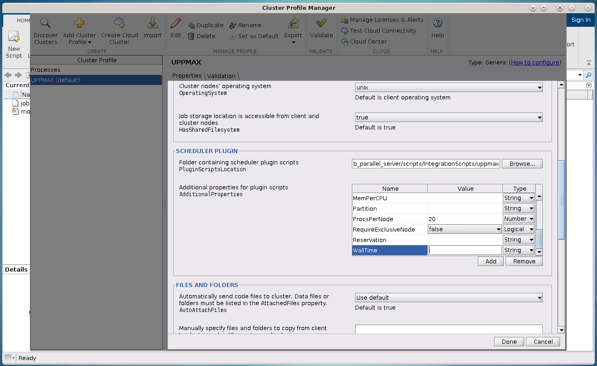

The Slurm job scheduler and MATLAB
==================================

.. questions::

   - What is a batch job?
   - How to make a batch job for MATLAB?
   - How to configure the cluster for MATLAB?
   
.. objectives:: 

   - Understand and use the Slurm scheduler
   - Configure the cluster
   - Start (MATLAB) batch jobs from the command line
   - Try example

.. admonition:: Compute allocations in this workshop 

   - Rackham: ``naiss2024-22-1202``
   - Kebnekaise: ``hpc2n2024-114``
   - Cosmos: ``lu2024-7-80``
 
.. admonition:: Storage space for this workshop 

   - Rackham: ``/proj/r-py-jl-m-rackham``
   - Kebnekaise: ``/proj/nobackup/r-py-jl-m`` 

.. warning::

   Any longer, resource-intensive, or parallel jobs must be run through a **batch script**.

The batch system used at UPPMAX, HPC2N, and LUNARC is called SLURM. The same is the case at most of the Swedish HPC centres. 

SLURM is an Open Source job scheduler, which provides three key functions:

- Keeps track of available system resources
- Enforces local system resource usage and job scheduling policies
- Manages a job queue, distributing work across resources according to policies

.. note:: 

   - If you have attended the other days you have learned that you ask for compute resources via the sbatch command.
       - In order to run a batch job, you need to create and submit a SLURM submit file (also called a batch submit file, a batch script, or a job script).
       - Guides and documentation at: https://docs.hpc2n.umu.se/documentation/batchsystem/intro/ and https://docs.uppmax.uu.se/cluster_guides/slurm/ and https://lunarc-documentation.readthedocs.io/en/latest/manual/submitting_jobs/manual_basic_job/  
   - MATLAB is well integrated with SLURM and because of that there are several ways to run these jobs:
       - Using the job scheduler (``batch`` command) in MATLAB Desktop/graphical interface (This is the Recommended Use).
       - Starting a ``parpool`` with a predefined cluster (This allows for more interactivity).
       - Writing a batch script as for any other software and submitting the job with the ``sbatch`` command from SLURM 
         (This could be useful if you want to run long jobs and you don't need to modify the code in the meantime).
   - In the following sections we will extend these concepts. 

Useful commands to the batch system
-----------------------------------

Before going into MATLAB specifics for batch jobs, we should look briefly at some useful commands.                                                

- Submit job: ``sbatch <jobscript.sh>``
- Get list of your jobs: ``squeue --me``
- Check on a specific job: ``scontrol show job <job-id>``
- Delete a specific job: ``scancel <job-id>``
- Useful info about a job: ``sacct -l -j <job-id> | less -S``
- Url to a page with info about the job (Kebnekaise only): ``job-usage <job-id>``

First time configuration
------------------------

In order to be able to submit jobs to the SLURM queue, you need to configure MATLAB:

.. admonition:: Follow these instructions to configure MATLAB

   - `HPC2N <https://www.hpc2n.umu.se/resources/software/configure-matlab-2018>`_
   - `UPPMAX <https://docs.uppmax.uu.se/software/matlab/#first-time-since-may-13-2024>`_
   - `LUNARC <https://lunarc-documentation.readthedocs.io/en/latest/guides/applications/MATLAB/#configuration-at-the-command-line>`_

- To be able to use MATLAB 2019b, and later, together with the batch system, MATLAB needs to be configured to use a cluster profile.
- This needs to be done only once for each cluster and each version of MATLAB.
- Note that this is done AFTER loading MATLAB.

This will provide a set of default specifications for batch and parallel jobs called a **cluster profile**. These specifications can be changed or added to at runtime, and it is possible to have more than one profile for a single release.

.. admonition:: configCluster(.sh) from the terminal 

   You do all these ONCE for each cluster, and for each version of MATLAB you use. You do this AFTER loading MATLAB but before starting the MATLAB command line or GUI.

   .. tabs:: 

      .. tab:: UPPMAX 

         .. code-block:: 

            configCluster.sh <project-id> 

      .. tab:: HPC2N 

         .. code-block:: 

            configCluster.sh 

      .. tab:: LUNARC

         .. code-block::

            configCluster.sh <project-id> 
        
         Choose "cosmos" when prompted.  
.. note:: 

   At LUNARC it is also possible do the cluster profile configuration on the MATLAB command line. In that case you just do 
   
   .. code-block:: 

      >> configCluster  

   Be sure to choose "cosmos" when prompted. After this, you can use the Cluster Profile Manager to add to or refine submission parameters.

**Example (HPC2N):** 

.. figure:: ../../img/configcluster.png
   :width: 350
   :align: center

Apart from whether or not to include the .sh and the project-id, it should work the same at all centers. 

**Example (LUNARC):**

.. code-block::

   [bbrydsoe@cosmos3 ~]$ configCluster.sh lu2024-7-68
   salloc: Granted job allocation 927531
   salloc: Waiting for resource configuration
   salloc: Nodes cn011 are ready for job

                               < M A T L A B (R) >
                     Copyright 1984-2023 The MathWorks, Inc.
                R2023b Update 7 (23.2.0.2515942) 64-bit (glnxa64)
                                 January 30, 2024

   To get started, type doc.
   For product information, visit www.mathworks.com.

   ip =

       "10.21.0.11"

    	   [1] aurora
   	   [2] cosmos
   2
   Select a cluster [1-2]: >>Complete.  Default cluster profile set to "cosmos R2023b".

   	   Must set AccountName and WallTime before submitting jobs to COSMOS.  E.g.

   	   >> c = parcluster;
   	   >> c.AdditionalProperties.AccountName = 'account-name';
   	   >> % 5 hour walltime
   	   >> c.AdditionalProperties.WallTime = '05:00:00';
   	   >> c.saveProfile

   MATLAB is configured for multi-node parallelism.

   salloc: Relinquishing job allocation 927531
   salloc: Job allocation 927531 has been revoked.
   [bbrydsoe@cosmos3 ~]$

.. exercise::

   Login to either HPC2N, UPPMAX, or LUNARC if you have not already. 
   
   Load the newest version of MATLAB (find with ``ml spider MATLAB``).
   
   On the command line, run ``configCluster.sh`` on HPC2N or ``configCluster.sh <project-id>`` on UPPMAX/LUNARC.   

MATLAB terminal interface
-------------------------

.. admonition:: Content

   - starting Matlab on the command line
   - Job settings
      - ``c.parcluster``
      - ``c.AdditionalProperties.``
      - ``c.batch``
   - Starting a job from within Matlab 

This section will show you how to use MATLAB completely from the shell/terminal without having to open the GUI. This could be useful if you only have a regular SSH connection or otherwise need to run something fast and lightweight instead of having to open the GUI. This is an extra advantage when you have a poor network connection. 

Starting MATLAB
~~~~~~~~~~~~~~~~
     
To start Matlab on the command line, without running the GUI, load the MATLAB version and do 

.. code-block::

   matlab -singleCompThread -nodisplay -nosplash -nodesktop

This starts MATLAB. 

.. warning::

   - On the login-nodes MATLAB MUST be started with the option '-singleCompThread', preventing MATLAB from using more than one thread.

**Working in MATLAB**

Of course, we can work in MATLAB like this in exactly the same way as in the GUI: 

.. code-block::
 
   $ matlab -singleCompThread -nodisplay -nosplash -nodesktop
   Opening log file:  /home/b/bbrydsoe/java.log.43927

                                     < M A T L A B (R) >
                           Copyright 1984-2023 The MathWorks, Inc.
                      R2023a Update 4 (9.14.0.2306882) 64-bit (glnxa64)
                                        June 19, 2023

 
   To get started, type doc.
   For product information, visit www.mathworks.com.
 
   >> a = [ 1 2 3 ; 4 5 6; 7 8 9];
   >> b = [ 7 5 6 ; 2 0 8; 5 7 1];
   >> c = a + b

   c =

        8     7     9
        6     5    14
       12    15    10

   >> d = a - b

   d =

       -6    -3    -3
        2     5    -2
        2     1     8

   >> e = c + d;
   >> e 

   e =

        2     4     6
        8    10    12
       14    16    18

   >> 

However, we are now going to look at running in batch on the compute nodes. 

Job settings at the command line
~~~~~~~~~~~~~~~~~~~~~~~~~~~~~~~~

If you want to run a MATLAB program on the cluster with batch, you have to set some things for the job. Start MATLAB and do this.  

.. code-block::

   >> c=parcluster('CLUSTER');
   >> c.AdditionalProperties.AccountName = 'PROJECT-ID';
   >> c.AdditionalProperties.WallTime = 'HHH1:MM:SS';
   >> c.saveProfile 

In order to list the content of your profile, do ``c.AdditionalProperties``. 

.. note::

   On UPPMAX, you should do 
   
   ``c=parcluster;`` 
   
   instead of 
   
   ``c=parcluster('CLUSTER')``. 

   You also need to add ``c.AdditionalProperties.ProcsPerNode=20;`` for UPPMAX. 

**Example, for HPC2N**

Asking for 1 hour walltime. 

.. code-block:: 

   >> c=parcluster('kebnekaise');
   >> c.AdditionalProperties.AccountName = 'hpc2n2024-114';
   >> c.AdditionalProperties.WallTime = '01:00:00';
   >> c.saveProfile

.. exercise:: Run job settings

   Do the job settings on one of:
   
   - HPC2N: CLUSTER=kebnekaise
   - UPPMAX: no CLUSTER, as said above - i.e. just c=parcluster;
   - LUNARC: CLUSTER=cosmos R2023b

   Remember, the project-id is:

   - Rackham: naiss2024-22-1202
   - Kebnekaise: hpc2n2024-114
   - Cosmos: lu2024-7-80 

   Since we are just doing a short test, you can use 15 min instead of 1 hour as I did. 

   Also remember the ``c.AdditionalProperties.ProcsPerNode=20`` if you are on UPPMAX. 

   Test that it was added (with ``c.AdditionalProperties``). 

Job settings in the Cluster Profile Manager
'''''''''''''''''''''''''''''''''''''''''''

.. note:: This is about the GUI

   You can change the job settings (or make them all together) inside the GUI. You change the job settings within the Cluster Profile Manager in that case. 

   Note that this is ONLY in the case you want to use the GUI. You can work completely from within the MATLAB terminal interface if you want. 

If you run MATLAB in the GUI after having configured the cluster, MATLAB will start with a default cluster profile, typically something that includes the name of the cluster. This is just the set of configurations that were set by `configCluster`. You can view, edit, and/or add to this profile by clicking the ``Parallel`` menu icon and selecting ``Create and Manage Clusters``.

.. figure:: img/Rackham-matlab-parallel.png
   :width: 550
   :align: center

   Location of Parallel Menu in GUI.

.. figure:: img/Rackham-matlab-cluster-profile-mgr.png
   :width: 550
   :align: center

   Cluster Profile Manager.

If you scroll down in the window that appears when you select the right cluster, you will see a box titled ``Scheduler Plugin``. This box lets you set SBATCH parameters like

- Your account name (project name),
- Your email address,
- The memory per CPU, including units,
- The number of processes per node,
- Which partition you want,
- Whether you need an exclusive node,
- The name of your reservation, and most importantly,
- The wall time for your job.

   Editing parameters of Scheduler Plugin in Cluster Profile Manager.

In other words, anything you might otherwise set by calling ``c.AdditionalProperties.<insert_property>=...`` can be set in the GUI in this scheduler plugin. Just keep in mind that these settings are saved between sessions.

If you are on Desktop On Demand on LUNARC, these settings do not override the parameters set in the GfxLauncher for the MATLAB GUI session itself, but rather to any batch jobs you submit from *within* the GUI.

More about MATLAB in the GUI in the next session. 

Running a job from within MATLAB terminal interface
~~~~~~~~~~~~~~~~~~~~~~~~~~~~~~~~~~~~~~~~~~~~~~~~~~~~~~~~

Starting a simple MATLAB program inside MATLAB on the terminal. It will as default use your cluster profile which you just created and saved above. 

.. code-block::

   job = batch('myScript');

batch does not block MATLAB and you can continue working while computations take place.

If you want to block MATLAB until the job finishes, use the wait function on the job object.

.. code-block::

   wait(job);

By default, MATLAB saves the Command Window output from the batch job to the diary of the job. To retrieve it, use the diary function.

.. code-block:: 

   diary(job)

After the job finishes, fetch the results by using the load function.

.. code-block::

   load(job,'x');
   
or with 

.. code-block::

   job.fetchOutputs{:}

- If you need the Job id, run ``squeue --me`` on the command line.
- To get the MATLAB jobid do ``id=job.ID`` within MATLAB. 
- To see if the job is running, inside MATLAB, do ``job.State``

Serial
''''''

After starting MATLAB, you can use this 

- Get a handle to the cluster (remember, on Rackham, just use ``c=parcluster;`` 

.. code-block::

   >> c=parcluster('CLUSTER')

- myfcn is a command or serial MATLAB program.
- N is the number of output arguments from the evaluated function
- x1, x2, x3,... are the input arguments

.. code-block:: 
   
   job = c.batch(@myfcn, N, {x1,x2,x3,...})

- Query the state of the job

.. code-block::

   j.State

- If the state of the job is finished, fetch the result

.. code-block:: 

   j.fetchOutputs{:}

- when you do not need the result anymore, delete the job

.. code-block::

   j.delete

If you are running a lot of jobs or if you want to quit MATLAB and restart it at a later time you can retrieve the list of jobs:

- Get the list of jobs 

.. code-block::

  jobs = c.Jobs

- Retrieve the output of the second job

.. code-block::

   j2=jobs(2)
   output = j2.fetchOutputs{:}

.. example:: Type-along!  

   After doing the job settings further up, let us try running an example. We will use the example ``add2.m`` which adds two numbers. I just used 1 and 2, but you can pick any numbers you want. You can find the ``add2.m`` script in the exercises/matlab directory or you can 'download it <https://raw.githubusercontent.com/UPPMAX/R-python-julia-matlab-HPC/refs/heads/main/exercises/matlab/add2.m>'_ from here.  

   .. code-block::

      job = c.batch(@add2, 1, {1,2})

   Check if it has finished with: 

   .. code-block:: 

      job.State

   When it has finished, retrieve the result with: 

   .. code-block:: 

      job.fetchOutputs{:}

Parallel
''''''''

Running parallel batch jobs are quite similar to running serial jobs, we just need to specify a MATLAB Pool to use and of course MATLAB code that is parallelized. This is easiest illustrated with an example:

- To make a pool of workers, and to give input etc. 

.. code-block::

   >> job = c.batch(@SCRIPT, #output, {input1, input2, input3, ...}, 'pool', #workers);

**Example:**

Running a simple Matlab script, parallel-example.m, giving the input "16", creating 4 workers, expecting 1 output. I use ``j`` instead of ``job`` to show that you can name as you want. 

.. code-block::

   >> j = c.batch(@parallel_example, 1, {16}, 'pool', 4);

Let us try running this on Kebnekaise, including checking state and then getting output:

.. code-block::

   >> j = c.batch(@parallel_example, 1, {16}, 'pool', 4);                            

   additionalSubmitArgs =

      '--ntasks=5 --cpus-per-task=1 -A hpc2n2024-114 -t 01:00:00'

   >> j.State

   ans =

       'running'

   >> j.State

   ans =

       'finished'
       
   >> j.fetchOutputs{:}

   ans =

       9.3387

   >>

.. exercise:: Try the above example. 

   It should work on all the clusters. 
   
   This exercise assumes you did the previous ones on this page; loading MATLAB, doing the configCluster.sh, adding the job settings. 
   
   You can download `parallel_example.m <https://raw.githubusercontent.com/UPPMAX/R-python-julia-matlab-HPC/refs/heads/main/exercises/matlab/parallel_example.m>`_ here.  

There is more information about batch jobs here on `Mathworks <https://se.mathworks.com/help/parallel-computing/batch.html>`_ .
   
MATLAB batch jobs
-----------------

.. admonition:: Content

   - Creating a batch script to run Matlab 
      - Serial
      - Parallel
        
While we can submit batch jobs (or even batch jobs of batch jobs) from inside MATLAB (and that may be the most common way of using the batch system with MATLAB), it is also possible to create a batch submit script and use that to run MATLAB. 

The difference here is that when the batch script has been submitted, you cannot make changes to your job. It is not interactive. That is also an advantage - you can submit the job, log out, and then come back later and see the results. 

.. warning::

   - ``parpool`` can only be used on UPPMAX and Cosmos.
  

Serial batch jobs 
~~~~~~~~~~~~~~~~~~~~~~~~

Here is an example of a serial batch job for UPPMAX/HPC2N/LUNARC. 

.. tabs::

   .. tab:: UPPMAX

      .. code-block:: 

         #!/bin/bash
         # Change to your actual project number later
         #SBATCH -A naiss2024-22-1202
         # Asking for 1 core
         #SBATCH -n 1
         # Asking for 30 min (change as you want) 
         #SBATCH -t 00:30:00
         #SBATCH --error=matlab_%J.err
         #SBATCH --output=matlab_%J.out

         # Clean the environment 
         module purge > /dev/null 2>&1

         # Change depending on resource and MATLAB version
         # to find out available versions: module spider matlab
         module add matlab/R2023b

         # Executing the matlab program monte_carlo_pi.m for the value n=100000
         # (n is number of steps - see program).
         # The command 'time' is timing the execution
         time matlab -nojvm -nodisplay -r "monte_carlo_pi(100000)"
    
   .. tab:: HPC2N 

      .. code-block:: 

         #!/bin/bash
         # Change to your actual project number later
         #SBATCH -A hpc2n2024-114
         # Asking for 1 core
         #SBATCH -n 1
         # Asking for 30 min (change as you want) 
         #SBATCH -t 00:30:00
         #SBATCH --error=matlab_%J.err
         #SBATCH --output=matlab_%J.out

         # Clean the environment 
         module purge > /dev/null 2>&1
 
         # Change depending on resource and MATLAB version
         # to find out available versions: module spider matlab
         module add MATLAB/2023a.Update4

         # Executing the matlab program monte_carlo_pi.m for the value n=100000
         # (n is number of steps - see program).
         # The command 'time' is timing the execution
         time matlab -nojvm -nodisplay -r "monte_carlo_pi(100000)"

   .. tab:: LUNARC 

      .. code-block:: 

         #!/bin/bash
         # Change to your actual project number later
         #SBATCH -A lu2024-7-80 
         # Asking for 1 core
         #SBATCH -n 1
         # Asking for 30 min (change as you want) 
         #SBATCH -t 00:30:00
         #SBATCH --error=matlab_%J.err
         #SBATCH --output=matlab_%J.out

         # Clean the environment 
         module purge > /dev/null 2>&1

         # Change depending on resource and MATLAB version
         # to find out available versions: module spider matlab
         module add matlab/2023b

         # Executing the matlab program monte_carlo_pi.m for the value n=100000
         # (n is number of steps - see program).
         # The command 'time' is timing the execution
         time matlab -nojvm -nodisplay -r "monte_carlo_pi(100000)"

You can download `monte_carlo_pi.m <https://raw.githubusercontent.com/UPPMAX/R-python-julia-matlab-HPC/refs/heads/main/exercises/matlab/monte_carlo_pi.m>`_ here or find it under matlab in the exercises directory. 

You the submit it with 

.. code-block::

   sbatch <batchscript.sh>

Where ``<batchscript.sh>`` is the name you gave your batchscript. You can find ones for each of the clusters in the ``exercises -> matlab`` directory, named ``monte_carlo_pi_<cluster>.sh``. 

.. exercise:: 

   Try run the serial batch script. Submit it, then check that it is running with ``squeue --me``. Check the output in the ``matlab_JOBID.out`` (and the error in the ``matlab_JOBID.err`` file). 

Parallel batch script
~~~~~~~~~~~~~~~~~~~~~~~~

This is an example batch script for parallel MATLAB 

.. code-block::

   #!/bin/bash
   # Change to your actual project number
   #SBATCH -A XXXX-YY-ZZZ 
   #SBATCH --ntasks-per-node=<how many tasks>
   #SBATCH --nodes <how many nodes> 

   # Asking for 30 min (change as you want)
   #SBATCH -t 00:30:00
   #SBATCH --error=matlab_%J.err
   #SBATCH --output=matlab_%J.out

   # Clean the environment
   module purge > /dev/null 2>&1

   # Change depending on resource and MATLAB version
   # to find out available versions: module spider matlab
   module add MATLAB/<version>

   # Executing a parallel matlab program 
   srun matlab -nojvm -nodisplay -r parallel-matlab-script.m

Inside the MATLAB code, the number of CPU-cores (NumWorkers in MATLAB terminology) can be specified when creating the parallel pool, for example, with 8 threads:

.. code-block::

   poolobj = parpool('local', 8);

.. exercise:: 

   Try making a batch script for running the ``parallel_example.m`` that was run in the example from inside MATLAB above. 

.. solution::

   .. tabs::

      .. tab:: UPPMAX 
         :class: dropdown
          
         .. code-block:: 

            #!/bin/bash
            # Change to your actual project number
            #SBATCH -A naiss2024-22-1202 
            # Remember, there are 4 workers and 1 master! 
            #SBATCH --ntasks=5
            #SBATCH --cpus-per-task=1
            #SBATCH --ntasks-per-node=5
            #SBATCH --ntasks-per-core=1
            # Asking for 30 min (change as you want)
            #SBATCH -t 00:30:00
            #SBATCH --error=matlab_%J.err
            #SBATCH --output=matlab_%J.out

            # Clean the environment
            module purge > /dev/null 2>&1

            # Change depending on resource and MATLAB version
            # to find out available versions: module spider matlab
            module add matlab/R2023b

            # Executing a parallel matlab program 
            srun matlab -nojvm -nodisplay -r parallel_example.m

      .. tab::
         :class: dropdown

      .. tab:: 
         :class: dropdown

GPU code
--------

.. admonition:: Content

   - How to use GPUs with Matlab 
      - Inside Matlab
      - In a batch script

In order to use GPUs, you have to ask for them. 

Inside MATLAB
~~~~~~~~~~~~~

.. note:: 

   In order to use GPUs from inside MATLAB, you add them as additional properties to your profile. 
   
   Remember, after it is saved to your profile it will use GPUs again next time you submit a job, even if you don't want GPUs there. To reset this, do: 

   .. code-block:: 

      c.AdditionalProperties.GpuCard = '';
      c.AdditionalProperties.GpusPerNode = '';
      
.. admonition:: GPU in batch job

   This is how you add GPUs to use in batch jobs submitted inside MATLAB: 

   .. tabs::

      .. tab:: UPPMAX

         Note: you have to first do an interactive session to Snowy, asking for GPUs, since there are no GPUs on Rackham. You should ask for at least 2 cores so Matlab will start. Ask for a GPU and enough time to do what you need. 

         .. code-block:: sh

            interactive -A naiss2024-22-1202 -n 2 -M snowy --gres=gpu:1  -t 2:00:00

         Load Matlab 

         .. code-block:: 

            ml matlab/R2023b

         Run Matlab either as GUI 

         .. code-block::

            matlab -singleCompThread 
            
         Or on the terminal 
         
         .. code-block::

            matlab -singleCompThread -nodisplay -nosplash -nodesktop 

         Then, inside MATLAB, you need to add this to your profile 

         .. code-block:: matlab 

            c.AdditionalProperties.GpusPerNode = 1;
            c.saveProfile

      .. tab:: HPC2N

         Load and start Matlab, then do 

         .. code-block:: matlab

            c.AdditionalProperties.GpuCard = 'card-type';
            c.AdditionalProperties.GpusPerNode = '#gpus';
            c.saveProfile
            
         where ``card-type`` is one of: v100, a40, a6000, l40s, a100, h100, mi100 

         and ``#gpus`` depends on the card-type: 

         - V100 (2 cards/node)
         - A40 (8 cards/node)
         - A6000 (2 cards/node)
         - L40s (2 or 6 cards/node)
         - A100 (2 cards/node)
         - H100 (4 cards/node)
         - MI100 (2 cards/node)

      .. tab:: LUNARC

         Load and start Matlab, then do

         .. code-block:: matlab 

            c.AdditionalProperties.GpusPerNode = #GPUs;
            c.saveProfile

         where #GPUs is 1 or 2. 

.. exercise:: 

   Try and add GPUs to your cluster profile, save it. Run ``c.AdditionalProperties`` to see what was added. Then do ``c.AdditionalProperties.GpusPerNode = '';`` to remove it. See that it was removed. 
         
Batch scripts 
~~~~~~~~~~~~~~~~

In order to use GPUs in a batch job, you do something like this: 

.. tabs:: 

   .. tab:: UPPMAX 

      .. code-block:: 

         #!/bin/bash
         # Change to your actual project number
         #SBATCH -A naiss20224-22-1202
         #SBATCH -n 2 
         #SBATCH -M snowy
         #SBATCH --gres=gpu:1
         # Asking for 30 min (change as you want)
         #SBATCH -t 00:30:00
         #SBATCH --error=matlab_%J.err
         #SBATCH --output=matlab_%J.out

         # Clean the environment
         module purge > /dev/null 2>&1

         # Change depending on resource and MATLAB version
         # to find out available versions: module spider matlab
         module add matlab/R2023b

         # Executing a parallel matlab program 
         matlab -nodisplay -nosplash -r "gpu-matlab-script.m"

   .. tab:: HPC2N

      .. code-block::

         #!/bin/bash
         # Change to your actual project number
         #SBATCH -A hpc2n2024-114
         #SBATCH -n 1 
         #SBATCH --gpus=<#gpus>
         #SBATCH -C <gpu-type>
         # Asking for 30 min (change as you want)
         #SBATCH -t 00:30:00
         #SBATCH --error=matlab_%J.err
         #SBATCH --output=matlab_%J.out

         # Clean the environment
         module purge > /dev/null 2>&1

         # Change depending on resource and MATLAB version
         # to find out available versions: module spider matlab
         module load MATLAB/2023a.Update4

         # Executing a parallel matlab program 
         matlab -nodisplay -nosplash -r "gpu-matlab-script.m"

      where ``gpu-type`` is one of: v100, a40, a6000, l40s, a100, h100, mi100 

      and ``#gpus`` depends on the card-type: 

      - V100 (2 cards/node)
      - A40 (8 cards/node)
      - A6000 (2 cards/node)
      - L40s (2 or 6 cards/node)
      - A100 (2 cards/node)
      - H100 (4 cards/node)
      - MI100 (2 cards/node)

   .. tab:: LUNARC 

      .. code-block::

         #!/bin/bash
         # Change to your actual project number
         #SBATCH -A lu2024-7-80
         #SBATCH -n 1 
         #SBATCH -p gpua100
         # The number of GPUs.#gpus, can be 1 or 2 
         #SBATCH --gpus=<#gpus>
         
         # Asking for 30 min (change as you want)
         #SBATCH -t 00:30:00
         #SBATCH --error=matlab_%J.err
         #SBATCH --output=matlab_%J.out

         # Clean the environment
         module purge > /dev/null 2>&1

         # Change depending on resource and MATLAB version
         # to find out available versions: module spider matlab
         module load matlab/2023b

         # Executing a parallel matlab program 
         matlab -nodisplay -nosplash -r "gpu-matlab-script.m"

.. keypoints::

   - The SLURM scheduler handles allocations to the calculation/compute nodes
   - Batch jobs run without interaction with user
   - A batch script consists of a part with SLURM parameters describing the allocation and a second part describing the actual work within the job, for instance one or several Matlab scripts.
   - You can run MATLAB as a batch job through a batch script or from inside MATLAB (shell or GUI)       
   - Remember to include possible input arguments to the MATLAB script in the batch script.
   - **You need to configure MATLAB before submitting batch jobs.** 
