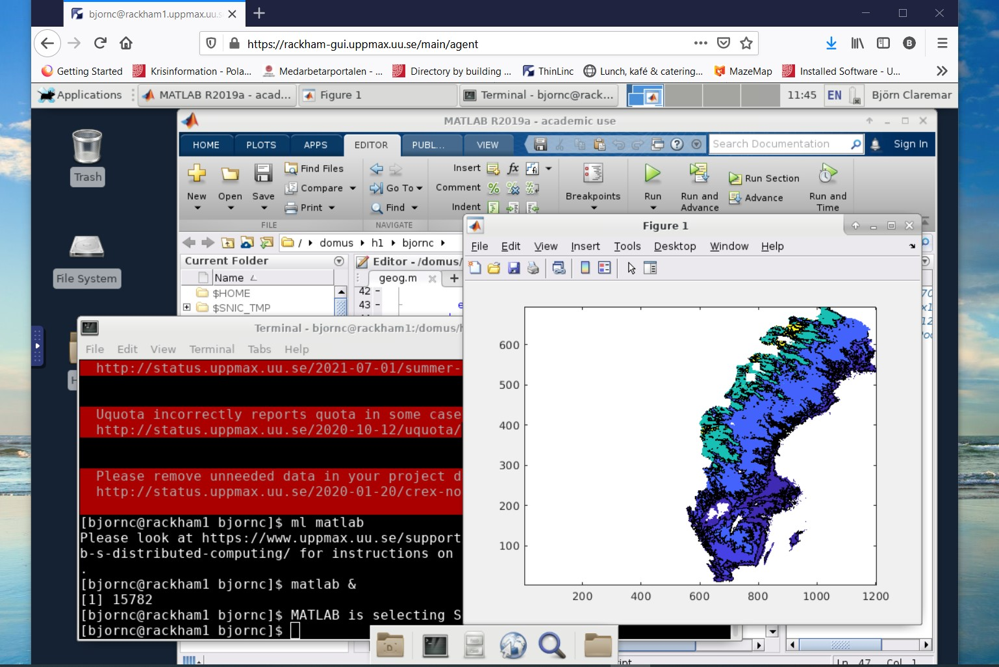

Pre-requirements
================

Technical on local computer
---------------------------

- We recommend that you set up both:

    - a terminal on you computer that can handle X11 graphics AND 
    - install the "Remote Access Desktop application" ThinLinc, see below.

Basic terminal clients 
#######################

**If you are in a hurry or get problems in the installation procedure you can do most of the work from these first steps.**

.. tabs::

   .. tab:: Mac

      - Use terminal (e.g. from Launchpad) or `iTerm2 <https://iterm2.com/>`_

      .. figure:: img/Mac_terminal.png
         :width: 550
         :align: center

         Mac built-in terminal

      - iTerm2 goodies:
         - You can save hosts for later.
         - Drag and drop scp

   .. tab:: Windows

      - the ssh (secure shell) client `putty <https://www.putty.org/>`_ is sufficient for most of course

         - You can save hosts for later.
         - No graphics.

      .. figure:: ./img/putty.jpg
         :width: 550
         :align: center

         Putty built-in terminal

      - Windows Powershell terminal can also work

         - Cannot save hosts
         - no graphics
         - `PowerShell <https://learn.microsoft.com/en-us/powershell/>`_
    
      - Windows command prompt can also work

         - Cannot save hosts
         - no graphics
         - `Command Prompt <https://www.makeuseof.com/tag/a-beginners-guide-to-the-windows-command-line/>`_

      - `Git bash <https://gitforwindows.org/>`_

Add X11 graphics to terminal
############################

.. tabs::

   .. tab:: Mac

      - Download and install **XQuartz** or other X11 server for Mac OS
         - https://www.xquartz.org

      - Start terminal (e.g. from Launchpad) or `iTerm2 <https://iterm2.com/>`_ 

   .. tab:: Windows

      - Either continue building upon Putty and install `XMING <https://sourceforge.net/projects/xming/>`_
            - When installed, start XMING and let run in background and then start putty and log in with ``ssh -X`` ...
      - OR
      - Install `MobaXterm <https://mobaxterm.mobatek.net/>`_  with built-in X11 and sftp file manager
         - sftp frame makes it easy to move, upload and download files.
         - ... though downloading from remote host to local is usually easier.
         - tabs for several sessions

      .. figure:: ./img/mobax.jpg

      - Start local terminal and a SSH session by:

      .. code-block:: console

         $ ssh -X <username>@rackham.uppmax.uu.se
         $ ssh -X <username>@kebnekaise.hpc2n.uu.se

      .. figure:: ./img/mobax_start1.jpg

      - Or even better, create and save a SSH session, as shown in image below.
          - This allows you to use MobaXterm as a file manager and  to use the built-in graphical texteditor.
          - You can rename the session in the Bookmark settings tab.

      .. figure:: ./img/mobax_start.jpg

.. admonition:: X11-forwarding from the command line (generally)

   - Graphics can be sent through the SSH connection you’re using to connect
      - Use primarily `ssh -X <...>` and secondary `ssh -Y <...>`
      - http://docs.uppmax.uu.se/software/ssh_x_forwarding/

   - The X servers that enables graphics are needed, as mentioned above!
      - When starting a graphical program, a new window will open, but your terminal will be “locked”.
      - Run using "`&`" at the end to run it as a background process e.g. "`xeyes &`" or “`gedit &`”

    .. figure:: ./img/xeyes.png

    - Alternatively, use `<ctrl>-z` to put a graphical window to sleep and type "`bg`" to make this process work in the background.

ThinLinc
########

- Rackham, Kebnekaise and Bianca offer graphical login.
- This gives you a desktop environment, as if you were working on your own computer!
- Install ThinLinc client
     - https://www.cendio.com/thinlinc/download

- Login to ThinLinc desktop application by providing the following

.. tabs::

   .. tab:: Rackham

      - server: rackham-gui.uppmax.uu.se

      - username

      - password
 
   .. tab:: Kebnekaise

      - server: kebnekaise-tl.hpc2n.umu.se

      - username

      - password

Try to log in
#############

- Follow the steps in the emailed instructions.
- First time you need to use a terminal to set password
- When password is set you can begin to use ThinLinc as well.

.. warning::

   - Using ThinLinc to log in to Rackham may require 2FA
     - https://www.uppmax.uu.se/support/user-guides/setting-up-two-factor-authentication/

- When logging in the first time in ThinLinc, choose XFCE desktop. 

- Test it!

.. seealso::

   `Log in to Rackham <http://docs.uppmax.uu.se/getting_started/login_rackham/>`_ 
   `Log in to Kebnekaise <http://docs.uppmax.uu.se/getting_started/login_rackham/>`_ 

.. keypoints::

   - When you log in from your local computer you will always arrive at a login node with limited resources. 
       - You reach the calculations nodes from within the login node (See  Submitting jobs section)
   - You reach UPPMAX clusters either using a terminal client or Thinlinc
   - Graphics are included in Thinlinc and from terminal if you have enabled X11.
   - Which client to use?
       - Graphics and easy to use
       - ThinLinc
   - Best integrated systems
      - Visual Studio Code has several extensions (remote, SCP, programming IDE:s)
      - Windows: MobaXterm is somewhat easier to use.
  

Text editors on the Clusters
----------------------------
- Nano
- gedit
- mobaxterm built-in

.. seealso::

   - http://docs.uppmax.uu.se/software/text_editors/

.. hint::

   - There are many ways to edit your scripts.
   - If you are rather new.

      - Graphical: ``$ gedit <script> &`` 
   
         - (``&`` is for letting you use the terminal while editor window is open)

         - Requires ThinLinc or ``ssh -Y ...`` or ``ssh -X``

      - Terminal: ``$ nano <script>``

   - Otherwise you would know what to do!
   - |:warning:| The teachers may use their common editor, like ``vi``/``vim``
      - If you get stuck, press: ``<esc>`` and then ``:q`` !
 

.. demo::

   - Let's make a script with the name ``example.py``  

   .. code-block:: console

      $ nano example.py

   - Insert the following text

   .. code-block:: python

      # This program prints Hello, world!
      print('Hello, world!')

   - Save and exit. In nano: ``<ctrl>+O``, ``<ctrl>+X``

   You can run a python script in the shell like this:

   .. code-block:: console

      $ python example.py
      # or 
      $ python3 example.py

Coding
------

- Basic knowledge of the languages used the different days. 
- We won't test your skills though.
- Rather you will learn to understand the ecosystems and navigations for the the different languages on a HPC cluster.

See below for links to useful material if you need a refresher before the course.

- More important is how to work in Linux and especially Bash
  
Linux
#####

- some familiarity with the LINUX command line (recordings from HPC2N:s Linux intro and UPPMAX Intro course), 

    - `Short introductions <https://uppsala.instructure.com/courses/67267/pages/using-the-command-line-bash?module_item_id=455632>`_
    - `Linux "cheat sheet" <https://www.hpc2n.umu.se/documentation/guides/linux-cheat-sheet>`_
    - UPPMAX
    
      - `Linux <http://docs.uppmax.uu.se/getting_started/linux/>`_
      - `Basic commands <http://docs.uppmax.uu.se/getting_started/linux_basics/>`_
      - `Whole intro course material <https://www.uppmax.uu.se/support/courses-and-workshops/uppmax-introductory-course/>`_
      - `UPPMAX software library <https://uppsala.instructure.com/courses/67267/pages/uppmax-basics-software?module_item_id=455641>`_
      
    - HPC2N
    
      - `HPC2N's intro course material (including link to recordings) <https://github.com/hpc2n/intro-course>`_
      - `HPC2N's YouTube channel video on Linux <https://www.youtube.com/watch?v=gq4Dvt2LeDg>`_

Material for improving your programming skills
##############################################

First level
:::::::::::

`The Carpentries <https://carpentries.org/>`_ teaches basic lab skills for research computing.

- `Software carpentry courses/material <https://software-carpentry.org/lessons/>`_ 

Second level
::::::::::::

`Code Refinery <https://coderefinery.org/>`_ develops and maintains training material on software best practices for researchers that already write code. 

- Their material addresses all academic disciplines and tries to be as programming language-independent as possible. 
- `Code refinery lessons <https://coderefinery.org/lessons/>`_     

Third level
:::::::::::

`ENCCS (EuroCC National Competence Centre Sweden) <https://enccs.se/>`_ is a national centre that supports industry, public administration and academia accessing and using European supercomputers. They give higher-level training of programming and specific software.

- `ENCCS training material <https://enccs.se/lessons/>`_ 

Understanding clusters
----------------------

The two HPC centers UPPMAX and HPC2N
------------------------------------

.. admonition:: Two HPC centers

   - There are many similarities:
   
     - Login vs. calculation/compute nodes
     - Environmental module system with software hidden until loaded with ``module load``
     - Slurm batch job and scheduling system
     - ``pip install`` procedure
     
   - ... and small differences:
   
     - commands to load Python, Python packages, R, Julia
     - slightly different flags to Slurm
     
   - ... and some bigger differences:
   
     - UPPMAX has three different clusters 

       - Rackham for general purpose computing on CPUs only
       - Snowy available for local projects and suits long jobs (< 1 month) and has GPUs
       - Bianca for sensitive data and has GPUs

   - HPC2N has Kebnekaise with GPUs  
   - Conda is recommended only for UPPMAX users
    
.. warning:: 

   - At both HPC2N and UPPMAX we call the applications available via the *module system* **modules**. 
   - https://www.uppmax.uu.se/resources/software/module-system/ 
   - https://www.hpc2n.umu.se/documentation/environment/lmod
   
   To distinguish these modules from the **python** *modules* that work as libraries we refer to the later ones as **packages**.
   
Briefly about the cluster hardware and system at UPPMAX and HPC2N
:::::::::::::::::::::::::::::::::::::::::::::::::::::::::::::::::

**What is a cluster?**

- Login nodes and calculations/computation nodes

- A network of computers, each computer working as a **node**.
     
- Each node contains several processor cores and RAM and a local disk called scratch.

.. figure:: ../img/node.png
   :align: center

- The user logs in to **login nodes**  via Internet through ssh or Thinlinc.

  - Here the file management and lighter data analysis can be performed.

.. figure:: ../img/nodes.png
   :align: center

- The **calculation nodes** have to be used for intense computing. 

Common features
###############

- Intel CPUs
- Linux kernel
- Bash shell

.. list-table:: Hardware
   :widths: 25 25 25 25 25
   :header-rows: 1

   * - Technology
     - Kebnekaise
     - Rackham
     - Snowy
     - Bianca
   * - Cores/compute node
     - 28 (72 for largemem part)
     - 20
     - 16
     - 16
   * - Memory/compute node
     - 128-3072 GB 
     - 128-1024 GB
     - 128-4096 GB
     - 128-512 GB
   * - GPU
     - NVidia V100, A100, old K80s
     - None
     - NVidia T4 
     - NVidia A100

Overview of the UPPMAX systems
##############################

.. mermaid:: mermaid/uppmax2.mmd

Overview of the HPC2N system
############################

.. mermaid:: mermaid/kebnekaise.mmd
