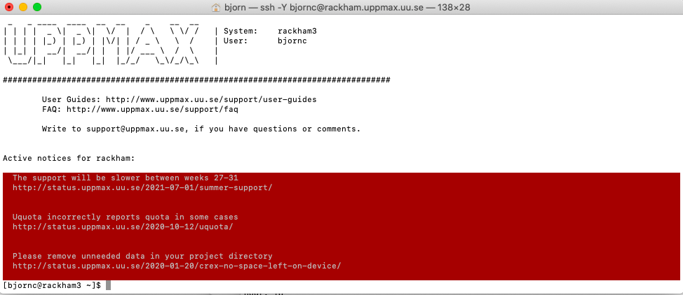

# Introduction


`Welcome page and syllabus <https://uppmax.github.io/HPC-python/index.html>`_
   - Also link at House symbol |:house:| at top of page 

**Learning outcomes**
   
   - Load Python modules and site-installed Python packages
   - Create a virtual environment
   - Install Python packages with pip (Kebnekaise, Rackham, Snowy)
   - Install Python packages with conda (Bianca)
   - Write a batchscript for running Python
   - Use Python in parallel
   - Use Python for ML
   - Use GPUs with Python

`````{tabs} 
````{tab} Mac

- Start terminal (e.g. from Launchpad) or [iTerm2](https://iterm2.com/)
```bash=
$ ssh <username>@rackham.uppmax.uu.se
```
- "< >" prompts you to set the keyword specific for you or your needs. In the example above, this is basically your username.


- iTerm2 goodies:
  - You can save hosts for later.
  - Drag and drop scp
```
````

````{tab} Windows

- the ssh (secure shell) client [**putty**](https://www.putty.org/) is sufficient first days of the course!

    - You can save hosts for later.
    - No graphics.
    - 
    
- Windows Powershell terminal can also work

    - Cannot save hosts
    - no graphics
    - [PowerShell](https://learn.microsoft.com/en-us/powershell/)
    
- Windows command prompt can also work

    - Cannot save hosts
    - no graphics
    - [Command Prompt](https://www.makeuseof.com/tag/a-beginners-guide-to-the-windows-command-line/))

- [Git bash](https://gitforwindows.org/)

}
```
````
`````

 
<Tabs
  defaultValue="apple"
  values={[
    {label: 'Apple', value: 'apple'},
    {label: 'Orange', value: 'orange'},
    {label: 'Banana', value: 'banana'},
  ]}>
  <TabItem value="apple">This is an apple 🍎</TabItem>
  <TabItem value="orange">This is an orange 🍊</TabItem>
  <TabItem value="banana">This is a banana 🍌</TabItem>
</Tabs>


=== "C"

    ``` c
    #include <stdio.h>

    int main(void) {
      printf("Hello world!\n");
      return 0;
    }
    ```

=== "C++"

    ``` c++
    #include <iostream>

    int main(void) {
      std::cout << "Hello world!" << std::endl;
      return 0;
    }
    ```
