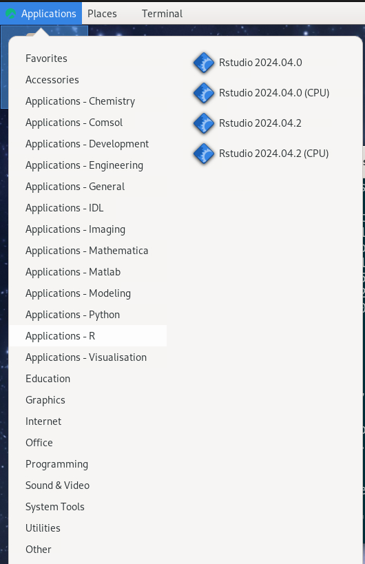

Using RStudio
=============

.. warning::

   Using RStudio differs between different HPC clusters.

   - We also recommend ThinLinc!

On UPPMAX
----------

There is a system installed version, available via the "rstudio" command (you
will get RStudio/1.1.423). 

However, we recommend you to use a RStudio module.

.. warning::

   We recommend ThinLinc because the graphics is more effective there!

   **Using ThinLinc**

   - ThinLinc app: ``<user>@rackham-gui.uppmax.uu.se``
   - ThinLinc in web browser: ``https://rackham-gui.uppmax.uu.se``   This requires 2FA!

   - Choose Xfce as the desktop environment (faster)
   - start a command line window

   **Using terminal**

   - Remember to have X11 installed!
   - On Mac

      - install XQuartz

   - On Windows

      - Use MobaXterm or

Check for RStudio versions
..........................

Check all available  versions with:

.. code-block:: console
 
   $ module avail RStudio

.. admonition:: Output at UPPMAX as of March 10 2024
   :class: dropdown
    
       .. code-block::  console
    
          [bjornc@rackham5 ~]$ ml av RStudio

          ------------------------------------- /sw/mf/rackham/applications -------------------------------------
             RStudio/1.0.136    RStudio/1.1.423     RStudio/2022.02.0-443    RStudio/2023.06.0-421
             RStudio/1.0.143    RStudio/1.1.463     RStudio/2022.02.3-492    RStudio/2023.06.2-561
             RStudio/1.0.153    RStudio/1.4.1106    RStudio/2022.07.1-554    RStudio/2023.12.1-402 (D)

            Where:
             D:  Default Module

          Use "module spider" to find all possible modules and extensions.
          Use "module keyword key1 key2 ..." to search for all possible modules matching any of the "keys".       

- load R_packages
- module load RStudio
- run ``rstudio &`` from the command line, and wait
  
   - it might take 5-10 minutes for RStudio to start, especially if you loaded R_packages as well, but once it starts, there should be no further delays
   - do *not* start RStudio through the graphical menu system in ThinLinc, this will not have access to loaded modules.
   - if it takes a long time and might be due to that you have saved a lot of workspace

Example:

.. demo::

   .. code:: console 

      $ module load R/4.1.1
      $ module load RStudio/2023.12.1-402
      $ rstudio &

   If you're going to run heavier computations within RStudio then you have to remember that you need to do it inside an interactive session on one of the computation nodes, and not on a login node. But if you mostly want to use it as a pretty code editor then you can run it on the login node as well.

   To use Rstudio on a compute node, start by asking SLURM for an interactive allocation (within the ThinLink session). E.g.

   .. code:: console

      $ interactive -A naiss2023-22-44 -p devcore -n 4 -t 10:00

On Bianca
''''''''''

When logging onto Bianca, you are placed on a login node, which nowadays has 2 CPU and a few GB of RAM. This is sufficient for doing some light-weight calculations, but interactive sessions and batch jobs provide access to much more resources and should be requested via the SLURM system.

The desktop client version of ThinLinc does not work for Bianca. Instead you run and login to ThinLinc in the browser:

- https://bianca.uppmax.uu.se

On HPC2N
--------

Rstudio also exists on Kebnekaise but is only installed on the ThinLinc login nodes and not on the compute nodes (and also not on the regular login nodes accessible with SSH). 
Thus, Rstudio should only be used for development and very light analysis, since there is no way to submit a job to the compute nodes.

Login to ThinLinc desktop application by providing the following 

- server: kebnekaise-tl.hpc2n.umu.se
- username
- password

Alternatively, you can use ThinLinc in the browser: https://kebnekaise-tl.hpc2n.umu.se:300/

When in ThinLinc, you can start Rstudio either from the menu (version 4.0.4) or from the command line. If you start it from the command line you first need to load R and its prerequisites, but you can pick between several versions this way. 

At LUNARC
----------

At LUNARC the recommended way to run RStudio is in Thinlinc with Desktop On Demand. All available versions are in the Applications menu under ``Applications-R``.

There is a regular version and a "(CPU)" version for each release.
- Regular versions run an Intel 32-core node with a GPU partition, but the wall time limit is 48 hours.
- CPU versions run on an AMD 48-core CPU-only node, and allows users to set a wall time of up to 168 hours (7 days), at the cost of reduced graphical support.

There is no need to pre-load any modules before starting RStudio from the Desktop On Demand ``Applications-R menu``.

If you run from the command line, you will need to load R/4.4.1 (check prerequisite versions of GCC and OpenMPI with ``ml spider R/4.4.1``) and one of the RStudio modules above. Please only launch RStudio from one of the Desktop On Demand terminals, not the front-end terminal in the ``Favorites`` menu.

.. admonition:: ``ml avail`` output at LUNARC as of October 21 2024
   :class: dropdown
    
       .. code-block::  console
    
          [<user>@cosmos2 /]$ ml avail RStudio
            
          --------------------- /sw/easybuild_milan/modules/all/Core ---------------------
               rstudio/2024.04.0-735    rstudio/2024.04.2-764 (D)
         
           Where:
            D:  Default Module
         
          If the avail list is too long consider trying:
         
          "module --default avail" or "ml -d av" to just list the default modules.
          "module overview" or "ml ov" to display the number of modules for each name.
         
          Use "module spider" to find all possible modules and extensions.
          Use "module keyword key1 key2 ..." to search for all possible modules matching
          any of the "keys".
