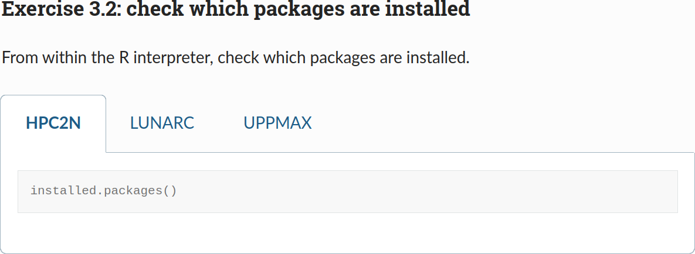
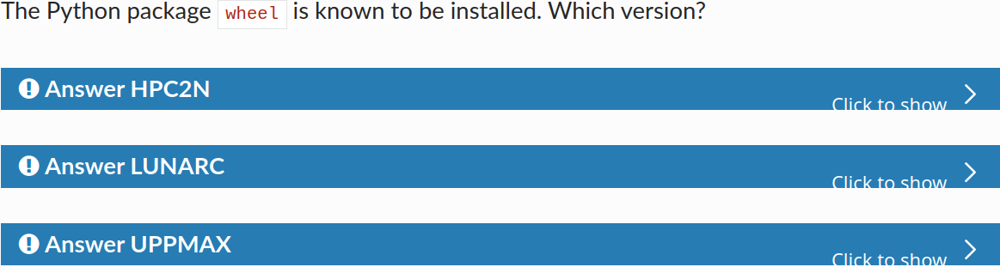

# Lesson plan R by Richel

- Date: Tuesday 2024-10-24
- Course: R, part of [R, Python, Julia, and Matlab in HPC](https://github.com/UPPMAX/R-python-julia-matlab-HPC/)

## Schedule

| Time  | Topic                                                                                          | Teacher(s)      |
| ----- | ---------------------------------------------------------------------------------------------- | --------------- |
| 9:00  | (optional) [First login](https://uppmax.github.io/R-python-julia-matlab-HPC/common/login.html) | BB + PO + RB    |
| 9:45  | Break                                                                                          | .               |
| 10:00 | Introduction                                                                                   | RB              |
| 10:10 | Syllabus                                                                                       | RB              |
| 10:20 | Load modules and run                                                                           | RB              |
| 10:45 | Break                                                                                          | .               |
| 11:00 | Packages                                                                                       | BB              |
| 11:30 | Isolated environments                                                                          | BB              |
| 12:00 | Lunch                                                                                          | .               |
| 13:00 | Batch                                                                                          | BB              |
| 13:30 | Parallel                                                                                       | PO              |
| 14:15 | Break                                                                                          | .               |
| 14:30 | Simultaneous session                                                                           | PO \* RB \* ?RP |
| 15:15 | Break                                                                                          | .               |
| 15:30 | Machine learning                                                                               | BB or PO        |
| 16:00 | Summary and evaluation                                                                         | RB              |
| 16:15 | Done                                                                                           | .               |

## Preparation

Here is the current state of my sessions:

Time  | Topic                   | State
------|-------------------------|------
10:00 | Introduction            | 10/10
10:10 | Syllabus                | 7/10
10:20 | Load modules and run    | 7/10
14:30 | Simultaneous session    | Done
16:00 | Summary and evaluation  | Done

In general:

- Go through the material
- Do the exercises for all centers
- Check the exercise by creating a video per center

Let's do this. 

Also:

- [x] Document how to get and extract the tarbal

Last session:

Time  | Topic                   | State
------|-------------------------|------
10:00 | Introduction            | Done
10:10 | Syllabus                | Done
10:20 | Load modules and run    | 7/10
14:30 | Simultaneous session    | Done
16:00 | Summary and evaluation  | Done

Currently, my sessions have two setups:

> The tab look

> The dropdown look

Today I feel the dropdown look to be cleaner,
as it preserves vertical space better,
so I'll use that one instead.
I do want to change the colors of the admonition per HPC center :-)

- [ ] change the colors of the admonition per HPC center
    - I gave up here

Videos are done, so the material is finished.

TODO:
- Check and prepare Priors

