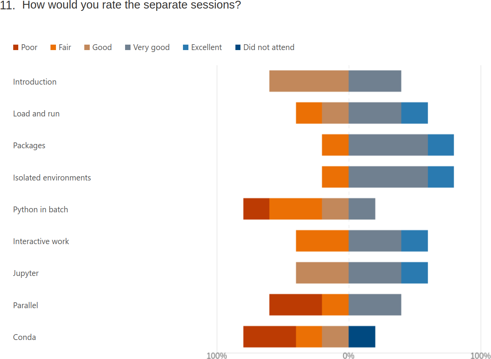
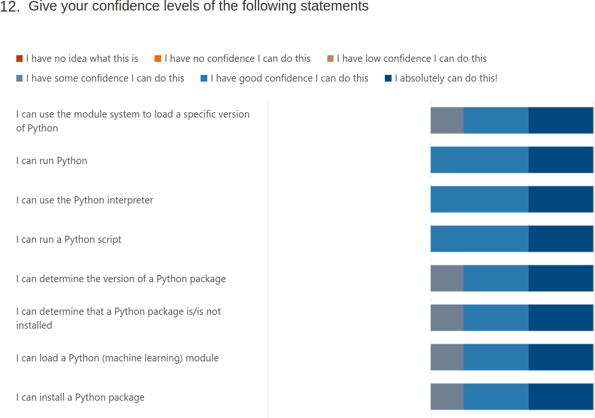
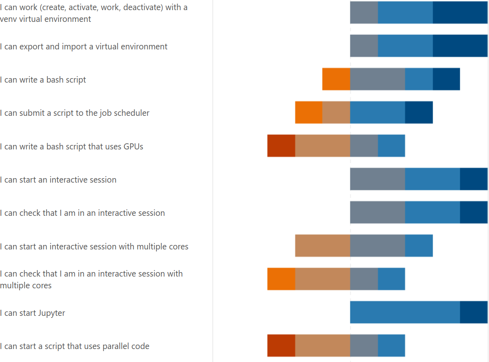
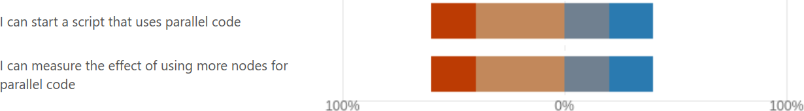

# Reflection

 * Teaching day: 2024-10-22
 * Topic: Python
 * Written on 2024-10-22

## Schedule

| Time  | Topic                                                                                          | Teacher(s)        |
| ----- | ---------------------------------------------------------------------------------------------- | ----------------- |
| 9:00  | (optional) [First login](https://uppmax.github.io/R-python-julia-matlab-HPC/common/login.html) | BB + PO + RB + RP |
| 9:45  | Break                                                                                          | .                 |
| 10:00 | Syllabus                                                                                       | RP                |
| 10:10 | Python in general                                                                              | RP                |
| 10:20 | Load modules and run                                                                           | RP                |
| 10:50 | Break                                                                                          | .                 |
| 11:05 | Packages                                                                                       | RB                |
| 11:35 | Isolated environments                                                                          | RB                |
| 12:00 | Lunch                                                                                          | .                 |
| 13:00 | Batch                                                                                          | BB                |
| 13:30 | GPU                                                                                            | BB                |
| 13:50 | Break                                                                                          | .                 |
| 14:05 | Simultaneous sessions                                                                          | BB * RB * RP      |
| 14:35 | Break                                                                                          | .                 |
| 14:50 | Parallel and multi-threaded functions                                                          | PO                |
| 15:35 | Summary and evaluation                                                                         | RB                |
| 15:50 | End of the day                                                                                 | .                 |

## Reflection before teaching

Before teaching, one thing that I think can be improved,
is our decision making. As an example, there was a change
decided upon regarding the schedule on 2024-10-18 (course is at 2024-10-21),
after we've already voted to accept the schedule before that.
I was unconvinced that we should change the schedule, but I was a minority,
so I accepted the democratic decision to change the schedule again.
I hope next time we can decide on the schedule earlier and freeze it,
say, at least one week before the course.

Before teaching, one thing that I think can be improved too,
is to use Markdown instead of RestructuredText:
using RestructuredText makes everything I do harder.
Taking a look at
[the StackOverflow developer survey of 2023](https://survey.stackoverflow.co/2023),
Markdown is mentioned and admired, where RestructuredText is completely absent.
I'd enjoy converting all these pages to Markdown and then use good MkDocs
instead :+1:

Before teaching, I was wondering about how we make sure the learners log
in. Currently, there is an onboarding session and a daily 9:00-9:50
optional login session. I feel we treat the learners better than reasonable:
when it is in the course prerequisites that its is required to be able to
log in and we have an onboarding, we should be able to assume that learners
can log in. This means that when a learner joins without being able
to log in, it is acceptable to only help the learner when there is time
(which is close to never). One way to meet in the middle, is to have daily
log in sessions at 8:00, so this will not affect the teaching.

Before teaching, I saw the evaluation. Beyond the 'rate your confidence'
questions I prepared, more questions were added. Maybe because HPC2N
requires that. 

These are the questions in the evaluation now:

```
Introduction to running R, Python, Julia, and Matlab in HPC, 22-25/10-2024 - DAY 1 Python

Thanks for your feedback.
This feedback will be published as-is at the end of the evaluation period (after 1 November 2024), if and only if there are no personal details (email, address, etc.) in the feedback. Do mention the teachers, assistants, etc by name!

1.Overall, how would you rate today's training event?

- Value from 1 to and including 10

2.Today's content and feedback to the lecturers (e.g. materials, exercises, structure): – What did you like best?

- Open question

3.Today's content and feedback to the lecturers (e.g. materials, exercises, structure): – Where should we improve?

- Open question

4.Training event organisation (e.g. announcement, registration, ...):  –   What did you like best?      – Where should we improve?

- Open question

5.Length of teaching today was
- Adequate
- Too short
- Too long

6.Depth of content was
- Adequate
- Too superficial
- Too profound

7.The pace of teaching was
- Adequate
- Too slow
- Too fast

8.Teaching aids used (e.g. slides) were well prepared
- Agree completely
- Agree
- No strong feelings
- Disagree
- Disagree completely

9.Hands-on exercises and demonstrations were
- Adequate
- Too few
- Too many

10.Hands-on exercises and demonstrations were well prepared
- Agree completely
- Agree
- No strong feelings
- Disagree
- Disagree completely

11.How would you rate the separate sessions?

- Introduction
- Load and run
- Packages
- Isolated environments
- Python in batch
- Interactive work
- Jupyter
- Parallel
- Conda

With answers
- Poor
- Fair
- Good
- Very good
- Excellent
- Did not attend

Give you confidence levels of the following statements,
using this scale:

- 0: I don't know even what this is about ...?
- 1: I have no confidence I can do this
- 2: I have low confidence I can do this
- 3: I have some confidence I can do this
- 4: I have good confidence I can do this
- 5: I absolutely can do this!

Give you confidence levels of the following statements below:

- I can use the module system to load a specific version of Python
- I can run Python
- I can use the Python interpreter
- I can run IPython
- I can use the IPython interpreter
- I can run a Python script
- I can determine the version of a Python package
- I can determine that a Python package is not installed
- I can load a Python package module
- I can install a Python package using ``pip``
- I can work (create, activate, work, deactivate) with a ``venv`` virtual environment
- I can write a bash script
- I can submit a script to the job scheduler
- I can write a bash script that uses GPUs
- I can start an interactive session
- I can check that I am in an interactive session
- I can start an interactive session with multiple cores
- I can check that I am in an interactive session with multiple cores
- I can start Jupyter
- I can start a script that uses parallel code
- I can measure the effect of using more nodes for parallel code

13.Did today's course meet your expectation?

- Yes
- No
- Not sure

14.Which future training topics would you like to be provided by the training host(s)?

- Open question

15.Do you have any additional comments?

- Open question
```

Only question 12 (the confidences) and 15 (any other comments)
are the ones that matter to me.

- [ ] In meeting with teachers, discuss the evaluation form

## Reflection after teaching

9:18: Around 12 learners have visited. After telling each of them
that they can go if (1) they have logged in and (2) can use a text editor,
around 3 hang around with their cameras off. I assume they are
waiting for the lesson to start.

- [x] Make this more explicit in the schedule
    - Done, for the Python and R schedules

The course started at 10:01. Due to technical issues, I took over the
first sessions without any preparations. I improvised in
following the Mike Bell teaching model
with Prior, Present, Challenge and Feedback and I think that went
well enough. During this improvised session, around a third of
the learners had their camera on, as per my request.
I felt there was enough time to work on exercises without disturbance.
When the technical issues were over, at 10:35,
my colleague took over the teacher role again.
In that improvised sessions, I did not talk much about IPython,
as I feel it is useless and time should be spent differently,
hence I predict low confidence for IPython.
Additionally, a colleague helped me remind about a shared document
where learners can ask questions. Also here, I spent less time
on this shared document, as I think it is not worth my
time to talk about a shared document I do not care about.

There was a learner that found a mistake in my teaching material,
about a mismatch in versions of matplotlib. I already fixed it :-)

My prepared part started at the 11:05 sharp (as per schedule).
Here, a fourth of the learners had their camera on.
I felt there was enough time to work on exercises without disturbance.
The durations of the sessions was long enough.
When polling if learners had completed the exercise by using Zoom
Reactions, two thirds gave a 'yes' as a reaction, the rest (all
without camera) having a 'no' as a reaction.

After the break, there was a simultaneous session that I was allowed
to teach, for UPPMAX users only. There 6 out of the 7 learners had
their camera on. Here, all learners with a camera having
achieved the teaching goal of starting Jupyter. 1 out of 7 got stuck
and I lead her to also start Jupyter.
I felt there was enough time to work on the exercise without disturbance.
The durations of the session was long enough.
I did not prepare for this session at all, as the material was good enough:
I'd feel at home with an UPPMAX-only group anyways and am confident
I can improvise there.
I did not use the course material at all, instead send the learners
to the documentation page with the procedure.
I think that that documentation page can be improved,
by rewriting an existing page.

- [ ] Improve https://docs.uppmax.uu.se/software/jupyter/
  similar to https://docs.uppmax.uu.se/software/jupyter_on_bianca/
- [ ] Add video

What I noticed in the simultaneous session, upon questioning the learners,
that 6 out of 6 learners did not know what a login node is.
From that I infer that this course is the first formal introduction
to our clusters for most of our learners.

For the summary and evaluation, I used question 12 of the evaluation form.
I think that was good enough. I did not use a breakout room, as we did
not practice that enough today.

In more general terms:

- I am happy to have had questions asked by learners during sessions.
  It hints that some think I am approachable.
- I am happy that all my exercises have answers and a video:
  the Feedback is there. Also, Feedback consisted
  out of two demos by learners and one one-on-one demo by me.
- The answers I provide, however, can be improved, by adding more
  'How does that look like?' dropdowns. I did not do it this time,
  as I struggled with the RST markup too much
- All my exercise sessions were 15 minutes. This was a good length.
  It was a lot of waiting and I was able to be silent too
- I am happy that my exercises use `wget` instead of a tarball.
  The word 'tarball' seemed already new for the learners, judging by
  their facial expression
- I am reasonably happy with the amount of interaction I got.
  I spoke with all learners that had their camera on.
  There were too many cameras off for my taste, maybe the recording causes
  this?

Suggests for next course:

- The [prerequirements](https://uppmax.github.io/R-python-julia-matlab-HPC/prereqs.html)
  should only be pre-requirements, not things that are 'nice to have'.
  I suggest to remove the whole 'Get familiar with the Linux/Bash command line'
  session
- The [login sessions](https://uppmax.github.io/R-python-julia-matlab-HPC/common/login.html)
  should only be about login. 
  Stating what the goal of this optional session is, would be enough.
  I suggest to remove anything but that.
- Remove IPython from session on running Python
- The evaluation form will be useless: in a course with 4 teachers,
  rating the course as a whole gives little information that is useful
  to a teacher. I don't care about the satisfaction of learners either:
  all I care about is if they have learned something, i.e. if they
  are confident in a topic I taught. I am interested in their free
  comments too. Besides that, the evaluation form feels like an administrative
  monster

## Summary of evaluation results

There are 5 evaluation results, out of the 9 learners that stayed in the end.

```
1. Overall, how would you rate today's training event?
- 7.4. Average Number
```

This question gives me no useful info.


```
2. Today's content and feedback to the lecturers (e.g. materials, exercises, structure): – What did you like best?
- "the best parts were how to find correct modules, submit jobs, and the examples for parallel codes "
- "materials"
```

This question gives me no useful info.


```
3. Today's content and feedback to the lecturers (e.g. materials, exercises, structure): – Where should we improve?

- "the lecturers shouldn't say the person's names and point to specific persons to reply questions"
- "Going through the examples more throughly."
```

I will definitely keep pointing to learners, as per the literature. 
Next time, I will show the references to the literature again.


```
4. Training event organisation (e.g. announcement, registration, ...): – What did you like best? – Where should we improve?
- "material online is excellent"
- "well organized"
```

No info.

```
5. Length of teaching today was
Adequate	3	
Too short	1	
Too long	1	
```

No info.

```
6. Depth of content was
Adequate	5	
Too superficial	0	
Too profound	0	
```

No info.

```
7. The pace of teaching was
Adequate	3	
Too slow	0	
Too fast	2	
```

No info: which session?

```
8. Teaching aids used (e.g. slides) were well prepared
Agree completely	0	
Agree	4	
No strong feelings	0	
Disagree	1	
Disagree completely	0	
```

No info: which session?

```
9. Hands-on exercises and demonstrations were
Adequate	3	
Too few	2	
Too many	0	
```

No info: which session?

```
10. Hands-on exercises and demonstrations were well prepared
Agree completely	3	
Agree	2	
No strong feelings	0	
Disagree	0	
Disagree completely	0	
```

No info: which session?


```
11. How would you rate the separate sessions?
Introduction
Load and run
Packages
Isolated environments
Python in batch
Interactive work
Jupyter
Parallel
Conda
```



I am happy to see that the 'Excellents' are all in sections
that I taught ('Packages', 'Isolated environments')
or that I may have taught (i.e. these we discussed in the simultaneous session)
('Interactive work', 'Jupyter') or that I partially taught ('Load and run').
The lowest rating ('poor') is in none of my sessions. I do see a low 'fair'
rating in my sessions, except for Jupyter, where there are more teachers.
My theory is that the person that did not like to be addressed by name
followed Jupyter in the HPC2N or LUNARC session and gave a 'fair'
to the other sessions.

```
12. Give your confidence levels of the following statements
I can use the module system to load a specific version of Python
I can run Python
I can use the Python interpreter
I can run a Python script
I can determine the version of a Python package
I can determine that a Python package is/is not installed
I can load a Python (machine learning) module
I can install a Python package
I can work (create, activate, work, deactivate) with a venv virtual environment
I can export and import a virtual environment
I can write a bash script
I can submit a script to the job scheduler
I can write a bash script that uses GPUs
I can start an interactive session
I can check that I am in an interactive session
I can start an interactive session with multiple cores
I can check that I am in an interactive session with multiple cores
I can start Jupyter
I can start a script that uses parallel code
I can measure the effect of using more nodes for parallel code
```

I am happy to see that the IPython question is not there.
Seems like I am not the only one that thinks it can be removed from the
course material?





The confidences that were lowest of the part I am one of the teachers
are 'I can start an interactive session with multiple cores'
and 'I can check that I am in an interactive session with multiple cores'.
I for sure did not teach this, as I felt there are more important things to
do. Also: I think other things are more important.

The sessions that I do care about ..

- I can determine the version of a Python package
- I can determine that a Python package is/is not installed
- I can load a Python (machine learning) module
- I can install a Python package
- I can work (create, activate, work, deactivate) with a venv virtual environment


... did reasonably well, with 1 learner
stating 'I have some confidence in this'. 
I wish I knew what was the problem with that one learner.

A weird response is 'I can export and import a virtual environment',
which had same confidences as the other session, although I did
not teach it! I hoped that the learners would all state 'I have no
idea what this is about'. Maybe some carry-over effect?

- [x] Remove question 'I can export and import a virtual environment' from evaluation
    - Done!

```
13.Did today's course meet your expectation?
Yes	3	
No	0	
Not sure	2	
```

Useless info to me.

```

14. Which future training topics would you like to be provided by the training host(s)?
"- xarray and dask"
```

Useless info to me.

```
15. Do you have any additional comments?
- A sheet summarizing the most important parts with key code snippets to do the items in 12)"
```

Fun! This learner suggests that I actually should have worked on a proper
summary page, with -indeed- the key points. Will do so next time! Thanks!

- [ ] Base summary on evaluation form

